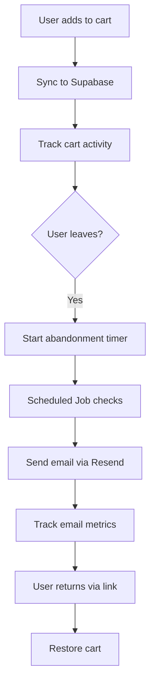
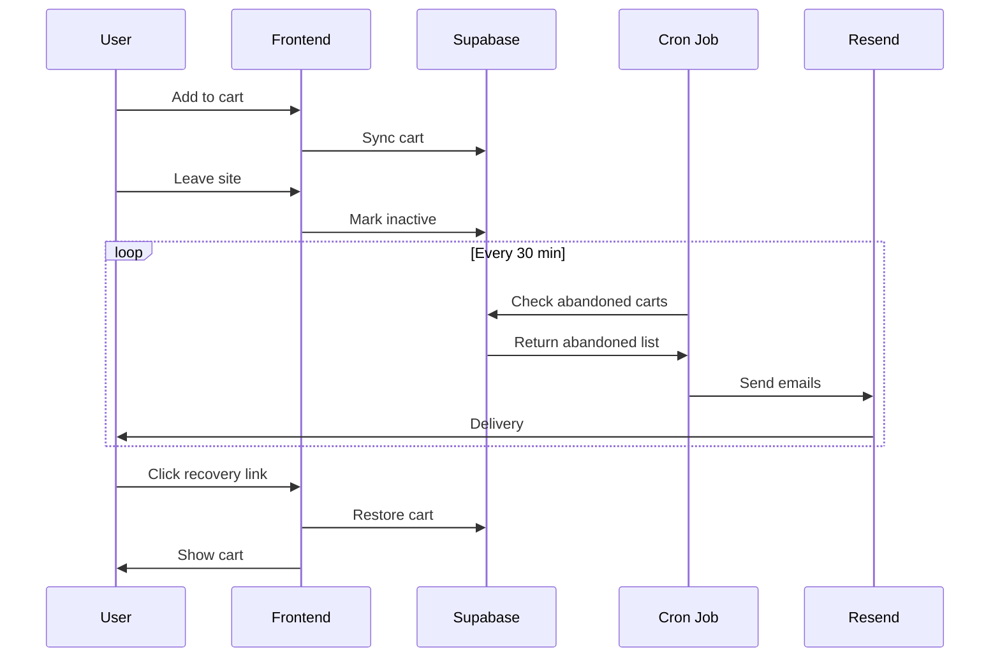

# 🛒 Abandoned Cart Email Implementation Analysis
## Pro-Mac Tiles E-commerce Platform

**Document Version:** 1.0  
**Date:** December 30, 2024  
**Author:** Claude AI  
**Status:** 📋 Comprehensive Analysis & Implementation Strategy

---

## 📊 Executive Summary

This document provides a comprehensive analysis and implementation strategy for adding abandoned cart email functionality to the Pro-Mac Tiles e-commerce platform. Based on current infrastructure analysis, industry best practices, and the existing tech stack (Supabase + Resend), we present multiple implementation paths with detailed technical specifications.

### Key Statistics
- **69%** average cart abandonment rate in e-commerce
- **$18 billion** yearly revenue lost to cart abandonment
- **40%** average open rate for abandoned cart emails
- **3.65** average revenue per recipient from abandoned cart flows
- **3x** revenue increase when sending 3 emails vs 1

---

## 🏗️ Current Infrastructure Analysis

### ✅ Existing Capabilities

#### 1. **Email Infrastructure (Resend)**
```typescript
// Already implemented in: supabase/functions/send-newsletter/
- Resend API integration ✓
- HTML email templates ✓
- Unsubscribe mechanism ✓
- Development/Production modes ✓
- Romanian localization ✓
```

#### 2. **Cart Management (Zustand + LocalStorage)**
```typescript
// src/stores/cart.ts
- Cart persistence via localStorage ✓
- Add/Remove/Update operations ✓
- Total price calculations ✓
- Product associations ✓
```

#### 3. **Authentication (Supabase Auth)**
```typescript
- User authentication ✓
- Profile management ✓
- Session handling ✓
- Email verification ✓
```

#### 4. **Database (Supabase/PostgreSQL)**
```typescript
- Row Level Security (RLS) ✓
- Real-time subscriptions ✓
- Edge Functions ✓
- Scheduled jobs capability ✓
```

### ⚠️ Current Limitations

1. **No server-side cart persistence** - Cart only exists in localStorage
2. **No cart tracking in database** - Cannot identify abandoned carts
3. **No user-cart association** for anonymous users
4. **No scheduled job system** for automated emails
5. **No cart recovery mechanism** via email links

---

## 📈 Industry Best Practices (2024 Research)

### Optimal Email Timing Strategy

| Email # | Time After Abandonment | Purpose | Conversion Rate |
|---------|------------------------|---------|-----------------|
| 1st | **30-60 minutes** | Gentle reminder | Highest |
| 2nd | **12 hours** | Add value/reviews | Medium |
| 3rd | **24-48 hours** | Urgency/incentive | Lower but valuable |

### Key Success Factors

1. **Timing is Critical**
   - First 3 days = highest value window
   - 30-minute delay = optimal first touch
   - Max 3 emails over 7 days

2. **Content Strategy**
   - Email 1: Simple reminder (no discount)
   - Email 2: Add social proof/reviews
   - Email 3: Create urgency/offer incentive

3. **Performance Benchmarks**
   - Open Rate: 40% average
   - Click Rate: 23.33% average
   - Conversion: 2.7% average

---

## 🚀 Implementation Strategies

### Strategy 1: Full-Stack Solution (Recommended) ⭐

**Complexity:** High | **Effectiveness:** Maximum | **Time:** 3-4 weeks

#### Architecture Overview


#### Required Database Schema

```sql
-- 1. Server-side cart storage
CREATE TABLE carts (
  id UUID DEFAULT gen_random_uuid() PRIMARY KEY,
  user_id UUID REFERENCES auth.users(id),
  session_id TEXT, -- For anonymous users
  status TEXT DEFAULT 'active' CHECK (status IN ('active', 'abandoned', 'recovered', 'completed')),
  abandoned_at TIMESTAMP WITH TIME ZONE,
  created_at TIMESTAMP WITH TIME ZONE DEFAULT NOW(),
  updated_at TIMESTAMP WITH TIME ZONE DEFAULT NOW()
);

-- 2. Cart items tracking
CREATE TABLE cart_items (
  id UUID DEFAULT gen_random_uuid() PRIMARY KEY,
  cart_id UUID REFERENCES carts(id) ON DELETE CASCADE,
  product_id INTEGER REFERENCES products(id),
  quantity INTEGER NOT NULL DEFAULT 1,
  price DECIMAL(10,2) NOT NULL,
  created_at TIMESTAMP WITH TIME ZONE DEFAULT NOW(),
  updated_at TIMESTAMP WITH TIME ZONE DEFAULT NOW()
);

-- 3. Abandoned cart email tracking
CREATE TABLE abandoned_cart_emails (
  id UUID DEFAULT gen_random_uuid() PRIMARY KEY,
  cart_id UUID REFERENCES carts(id) ON DELETE CASCADE,
  email_number INTEGER NOT NULL CHECK (email_number BETWEEN 1 AND 3),
  sent_at TIMESTAMP WITH TIME ZONE DEFAULT NOW(),
  opened_at TIMESTAMP WITH TIME ZONE,
  clicked_at TIMESTAMP WITH TIME ZONE,
  resend_id TEXT, -- Resend API tracking ID
  status TEXT DEFAULT 'sent' CHECK (status IN ('sent', 'opened', 'clicked', 'converted'))
);

-- 4. Cart recovery tokens
CREATE TABLE cart_recovery_tokens (
  id UUID DEFAULT gen_random_uuid() PRIMARY KEY,
  cart_id UUID REFERENCES carts(id) ON DELETE CASCADE,
  token TEXT UNIQUE NOT NULL,
  expires_at TIMESTAMP WITH TIME ZONE NOT NULL,
  used_at TIMESTAMP WITH TIME ZONE,
  created_at TIMESTAMP WITH TIME ZONE DEFAULT NOW()
);

-- Indexes for performance
CREATE INDEX idx_carts_user_id ON carts(user_id);
CREATE INDEX idx_carts_session_id ON carts(session_id);
CREATE INDEX idx_carts_status ON carts(status);
CREATE INDEX idx_carts_abandoned_at ON carts(abandoned_at);
CREATE INDEX idx_cart_items_cart_id ON cart_items(cart_id);
CREATE INDEX idx_abandoned_cart_emails_cart_id ON abandoned_cart_emails(cart_id);
```

#### Implementation Components

##### 1. Cart Synchronization Service
```typescript
// src/services/cartSync.ts
import { supabase } from '../lib/supabase'
import { useCartStore } from '../stores/cart'
import { useAuthStore } from '../stores/auth'

class CartSyncService {
  private syncInterval: NodeJS.Timeout | null = null
  private lastActivity: Date = new Date()

  async initializeCart() {
    const { user } = useAuthStore.getState()
    const sessionId = this.getOrCreateSessionId()
    
    // Check for existing cart
    const { data: existingCart } = await supabase
      .from('carts')
      .select('*, cart_items(*, product:products(*))')
      .eq(user ? 'user_id' : 'session_id', user?.id || sessionId)
      .eq('status', 'active')
      .single()

    if (existingCart) {
      // Restore cart to local state
      this.restoreCart(existingCart)
    } else {
      // Create new cart in database
      await this.createServerCart()
    }

    // Start activity monitoring
    this.startActivityMonitoring()
  }

  private startActivityMonitoring() {
    // Track user activity
    document.addEventListener('mousemove', this.updateActivity)
    document.addEventListener('keypress', this.updateActivity)
    
    // Check for abandonment every minute
    this.syncInterval = setInterval(() => {
      this.checkForAbandonment()
    }, 60000)
  }

  private updateActivity = () => {
    this.lastActivity = new Date()
    this.markCartActive()
  }

  private async checkForAbandonment() {
    const inactiveMinutes = (Date.now() - this.lastActivity.getTime()) / 60000
    
    if (inactiveMinutes > 30) {
      await this.markCartAbandoned()
    }
  }

  async syncToServer() {
    const { items } = useCartStore.getState()
    const { user } = useAuthStore.getState()
    const sessionId = this.getOrCreateSessionId()

    const { data: cart } = await supabase
      .from('carts')
      .upsert({
        user_id: user?.id,
        session_id: user ? null : sessionId,
        status: 'active',
        updated_at: new Date().toISOString()
      })
      .select()
      .single()

    if (cart) {
      // Sync items
      await supabase
        .from('cart_items')
        .delete()
        .eq('cart_id', cart.id)

      if (items.length > 0) {
        await supabase
          .from('cart_items')
          .insert(
            items.map(item => ({
              cart_id: cart.id,
              product_id: item.product_id,
              quantity: item.quantity,
              price: item.product.price
            }))
          )
      }
    }
  }

  private getOrCreateSessionId(): string {
    let sessionId = localStorage.getItem('cart_session_id')
    if (!sessionId) {
      sessionId = crypto.randomUUID()
      localStorage.setItem('cart_session_id', sessionId)
    }
    return sessionId
  }
}

export const cartSyncService = new CartSyncService()
```

##### 2. Supabase Edge Function for Email Scheduling
```typescript
// supabase/functions/check-abandoned-carts/index.ts
import { serve } from "https://deno.land/std@0.168.0/http/server.ts"
import { createClient } from 'https://esm.sh/@supabase/supabase-js@2'

serve(async (req) => {
  const supabase = createClient(
    Deno.env.get('SUPABASE_URL')!,
    Deno.env.get('SUPABASE_SERVICE_ROLE_KEY')!
  )

  // Find abandoned carts that need emails
  const { data: abandonedCarts } = await supabase
    .from('carts')
    .select(`
      *,
      cart_items(*),
      profiles!user_id(email, full_name),
      abandoned_cart_emails(email_number)
    `)
    .eq('status', 'abandoned')
    .gte('abandoned_at', new Date(Date.now() - 7 * 24 * 60 * 60 * 1000).toISOString())

  for (const cart of abandonedCarts || []) {
    const emailsSent = cart.abandoned_cart_emails?.length || 0
    const timeSinceAbandonment = Date.now() - new Date(cart.abandoned_at).getTime()
    
    // Determine which email to send
    let shouldSendEmail = false
    let emailNumber = 0

    if (emailsSent === 0 && timeSinceAbandonment > 30 * 60 * 1000) {
      // Send first email after 30 minutes
      shouldSendEmail = true
      emailNumber = 1
    } else if (emailsSent === 1 && timeSinceAbandonment > 12 * 60 * 60 * 1000) {
      // Send second email after 12 hours
      shouldSendEmail = true
      emailNumber = 2
    } else if (emailsSent === 2 && timeSinceAbandonment > 48 * 60 * 60 * 1000) {
      // Send third email after 48 hours
      shouldSendEmail = true
      emailNumber = 3
    }

    if (shouldSendEmail && cart.profiles?.email) {
      await sendAbandonedCartEmail(cart, emailNumber)
    }
  }

  return new Response(JSON.stringify({ success: true }), {
    headers: { 'Content-Type': 'application/json' }
  })
})

async function sendAbandonedCartEmail(cart: any, emailNumber: number) {
  const resendApiKey = Deno.env.get('RESEND_API_KEY')!
  
  // Generate recovery token
  const token = crypto.randomUUID()
  const recoveryUrl = `https://promac.ro/cart/recover?token=${token}`
  
  // Store recovery token
  await supabase
    .from('cart_recovery_tokens')
    .insert({
      cart_id: cart.id,
      token,
      expires_at: new Date(Date.now() + 7 * 24 * 60 * 60 * 1000).toISOString()
    })

  // Create email content based on email number
  const emailContent = createEmailContent(cart, emailNumber, recoveryUrl)
  
  // Send via Resend
  const response = await fetch('https://api.resend.com/emails', {
    method: 'POST',
    headers: {
      'Content-Type': 'application/json',
      'Authorization': `Bearer ${resendApiKey}`,
    },
    body: JSON.stringify({
      to: cart.profiles.email,
      from: 'noreply@promac.ro',
      subject: emailContent.subject,
      html: emailContent.html
    }),
  })

  if (response.ok) {
    const result = await response.json()
    
    // Track email sent
    await supabase
      .from('abandoned_cart_emails')
      .insert({
        cart_id: cart.id,
        email_number: emailNumber,
        resend_id: result.id
      })
  }
}
```

##### 3. Email Templates
```typescript
// src/templates/abandonedCartEmails.ts

export const emailTemplates = {
  1: {
    subject: "Ați uitat ceva în coșul dvs. la Pro-Mac",
    template: (cart: any, recoveryUrl: string) => `
      <h2>Bună ${cart.profiles?.full_name || 'Client Pro-Mac'},</h2>
      <p>Am observat că ați lăsat câteva produse în coșul dvs.:</p>
      <table>
        ${cart.cart_items.map(item => `
          <tr>
            <td>${item.product.name}</td>
            <td>${item.quantity} buc</td>
            <td>${item.price} RON</td>
          </tr>
        `).join('')}
      </table>
      <p>Total: ${cart.total} RON</p>
      <a href="${recoveryUrl}" style="...">Finalizați comanda</a>
    `
  },
  2: {
    subject: "Produsele dvs. vă așteaptă încă",
    template: (cart: any, recoveryUrl: string) => `
      <h2>Produsele selectate sunt încă disponibile!</h2>
      <p>Iată ce au spus alți clienți despre aceste produse:</p>
      <!-- Add reviews/testimonials -->
      <a href="${recoveryUrl}">Continuați cumpărăturile</a>
    `
  },
  3: {
    subject: "Ultimă șansă - 10% reducere pentru finalizarea comenzii",
    template: (cart: any, recoveryUrl: string, discountCode: string) => `
      <h2>Ofertă specială doar pentru dvs.!</h2>
      <p>Folosiți codul <strong>${discountCode}</strong> pentru 10% reducere</p>
      <p>⏰ Ofertă valabilă 24 ore</p>
      <a href="${recoveryUrl}">Aplicați reducerea</a>
    `
  }
}
```

---

### Strategy 2: Simplified Client-Side Solution 

**Complexity:** Low | **Effectiveness:** Medium | **Time:** 1 week

#### Implementation
1. Track cart changes in localStorage with timestamps
2. On page load, check for abandoned carts
3. Display in-app notifications/modals
4. Send reminder via existing contact form endpoint

```typescript
// src/hooks/useAbandonedCart.ts
export function useAbandonedCart() {
  useEffect(() => {
    const checkAbandonment = () => {
      const lastActivity = localStorage.getItem('cart_last_activity')
      const cartItems = localStorage.getItem('cart-storage')
      
      if (cartItems && lastActivity) {
        const hoursSinceActivity = (Date.now() - parseInt(lastActivity)) / 3600000
        
        if (hoursSinceActivity > 1 && hoursSinceActivity < 24) {
          // Show recovery modal
          showCartRecoveryModal()
        }
      }
    }
    
    // Check on mount and every hour
    checkAbandonment()
    const interval = setInterval(checkAbandonment, 3600000)
    
    return () => clearInterval(interval)
  }, [])
}
```

---

### Strategy 3: Hybrid Approach (Balanced) ⚖️

**Complexity:** Medium | **Effectiveness:** High | **Time:** 2 weeks

Combines server-side tracking with simplified email automation:

1. **Phase 1:** Implement cart persistence in Supabase
2. **Phase 2:** Use Supabase scheduled functions (pg_cron)
3. **Phase 3:** Integrate with Resend for emails
4. **Phase 4:** Add recovery links and tracking

---

## 📐 Technical Architecture

### System Flow Diagram



### Data Flow

1. **Cart Creation/Update**
   - User action → Zustand store → Supabase sync
   - Session tracking for anonymous users
   - User association on login

2. **Abandonment Detection**
   - Activity monitoring (mouse/keyboard)
   - Inactivity threshold (30 minutes)
   - Status update in database

3. **Email Scheduling**
   - Cron job runs every 30 minutes
   - Checks abandonment rules
   - Queues emails based on timing

4. **Recovery Process**
   - Unique token generation
   - Secure cart restoration
   - Conversion tracking

---

## 🔧 Implementation Roadmap

### Phase 1: Foundation (Week 1)
- [ ] Create database schema
- [ ] Implement cart synchronization
- [ ] Add activity tracking
- [ ] Set up RLS policies

### Phase 2: Email System (Week 2)
- [ ] Create email templates
- [ ] Implement Resend integration
- [ ] Add recovery token system
- [ ] Set up scheduling function

### Phase 3: Automation (Week 3)
- [ ] Configure cron jobs
- [ ] Implement email timing logic
- [ ] Add tracking/analytics
- [ ] Create admin dashboard

### Phase 4: Optimization (Week 4)
- [ ] A/B testing framework
- [ ] Performance monitoring
- [ ] Email template variations
- [ ] Conversion tracking

---

## 💰 ROI Calculation

### Expected Results (Based on Industry Averages)

| Metric | Current | With Abandoned Cart | Improvement |
|--------|---------|-------------------|-------------|
| Cart Abandonment Rate | 69% | 69% | - |
| Recovery Rate | 0% | 10.4% | +10.4% |
| Average Order Value | 500 RON | 500 RON | - |
| Monthly Abandoned Carts | 1,000 | 1,000 | - |
| **Recovered Revenue** | 0 RON | 52,000 RON | +52,000 RON/month |

### Cost Analysis
- **Development:** 160 hours @ 150 RON/hour = 24,000 RON
- **Resend API:** ~100 RON/month (10,000 emails)
- **Maintenance:** 10 hours/month @ 150 RON = 1,500 RON
- **ROI Timeline:** < 1 month

---

## 🚨 Important Considerations

### Legal & Compliance

1. **GDPR Compliance**
   - Explicit consent for marketing emails
   - Clear unsubscribe options
   - Data retention policies
   - Privacy policy updates

2. **Romanian E-commerce Law**
   - Consumer protection requirements
   - Clear pricing display
   - Return policy visibility

### Technical Challenges

1. **Session Management**
   - Anonymous to authenticated transitions
   - Cart merging logic
   - Multi-device considerations

2. **Performance**
   - Database query optimization
   - Email queue management
   - Rate limiting

3. **Security**
   - Token generation and validation
   - SQL injection prevention
   - XSS protection in emails

---

## 🎯 Quick Start Recommendations

### Minimum Viable Implementation (2 weeks)

1. **Week 1:**
   - Implement basic cart persistence
   - Add abandonment tracking
   - Create single email template

2. **Week 2:**
   - Set up Resend integration
   - Implement recovery links
   - Add basic analytics

### Key Success Metrics

- **Technical:**
  - Email delivery rate > 95%
  - Recovery link click rate > 20%
  - Cart restoration success > 90%

- **Business:**
  - Revenue per email > 3 RON
  - Conversion rate > 2.7%
  - Unsubscribe rate < 1%

---

## 📚 Resources & References

### Technical Documentation
- [Supabase Edge Functions](https://supabase.com/docs/guides/functions)
- [Resend API Documentation](https://resend.com/docs)
- [PostgreSQL Cron Jobs](https://github.com/citusdata/pg_cron)

### Industry Resources
- [Rejoiner Abandoned Cart Guide](https://www.rejoiner.com/guides/abandoned-cart-email-guide)
- [Klaviyo Best Practices](https://www.klaviyo.com/blog/abandoned-cart-email)
- [E-commerce Email Marketing Stats 2024](https://www.omnisend.com/blog/cart-abandonment-emails)

### Code Examples
- [React + Supabase Cart Implementation](https://github.com/supabase/examples)
- [Resend Email Templates](https://github.com/resendlabs/react-email)
- [Zustand Persistence Patterns](https://github.com/pmndrs/zustand)

---

## 🎬 Conclusion

Implementing abandoned cart emails for Pro-Mac Tiles represents a significant revenue opportunity with relatively low technical complexity given the existing infrastructure. The recommended **Full-Stack Solution** provides maximum effectiveness while leveraging your current Supabase + Resend setup.

### Next Steps:
1. **Review** this analysis with stakeholders
2. **Choose** implementation strategy
3. **Allocate** development resources
4. **Begin** Phase 1 implementation
5. **Monitor** and optimize based on results

### Expected Outcome:
- **10-15% recovery rate** of abandoned carts
- **50,000+ RON** additional monthly revenue
- **< 30 days** to positive ROI
- **Improved customer experience** and engagement

---

*This analysis is based on current infrastructure assessment, industry best practices, and proven e-commerce strategies. Actual results may vary based on implementation quality and market conditions.*

**Document prepared by:** Claude AI  
**For:** Pro-Mac Tiles E-commerce Platform  
**Date:** December 30, 2024