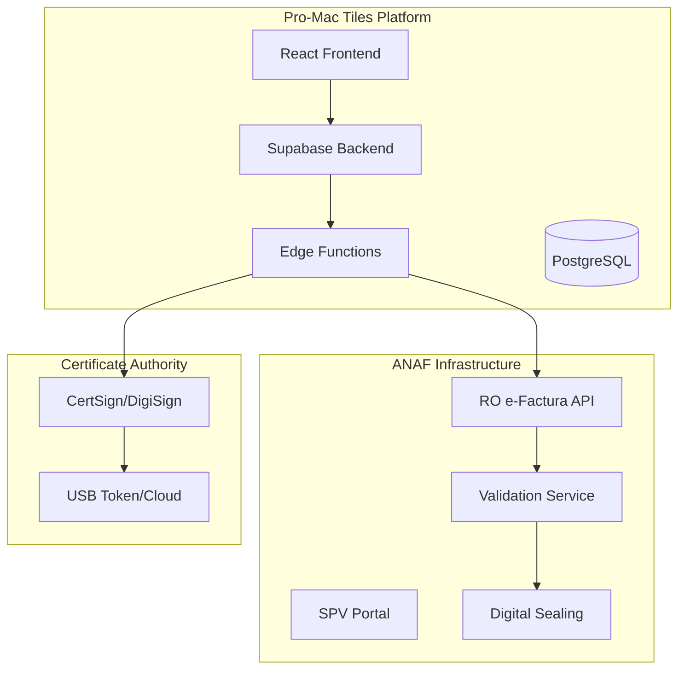

# Romanian E-Factura Implementation Guide for Pro-Mac Tiles E-commerce Platform

## Executive Summary

This comprehensive guide covers the implementation of Romania's mandatory **e-Factura** (electronic invoicing) system for the Pro-Mac Tiles e-commerce platform. As of January 1, 2025, B2C e-invoicing is mandatory for all Romanian businesses, making this integration critical for compliance. This document provides technical architecture, implementation strategies, corner cases, and best practices for integrating e-Factura with your React/TypeScript/Supabase stack.

---

## Table of Contents

1. [Regulatory Landscape & Compliance Requirements](#regulatory-landscape--compliance-requirements)
2. [Technical Architecture Overview](#technical-architecture-overview)
3. [Authentication & Certificate Management](#authentication--certificate-management)
4. [XML Format & Data Structure](#xml-format--data-structure)
5. [API Integration Strategy](#api-integration-strategy)
6. [Implementation Architecture for Pro-Mac Tiles](#implementation-architecture-for-pro-mac-tiles)
7. [Corner Cases & Error Handling](#corner-cases--error-handling)
8. [Testing Strategy & Validation](#testing-strategy--validation)
9. [Security & Compliance Considerations](#security--compliance-considerations)
10. [Monitoring & Maintenance](#monitoring--maintenance)
11. [Implementation Roadmap & Timeline](#implementation-roadmap--timeline)
12. [Cost Analysis & Resource Requirements](#cost-analysis--resource-requirements)

---

## Regulatory Landscape & Compliance Requirements

### Mandatory Implementation Timeline

| Transaction Type | Mandatory Date | Grace Period | Penalty After Grace |
|-----------------|----------------|--------------|-------------------|
| **B2G** | July 1, 2022 | N/A | 15% of transaction value |
| **B2B** | January 1, 2024 | May 31, 2024 | 1,000-10,000 RON |
| **B2C** | January 1, 2025 | March 31, 2025 | 1,000-10,000 RON |
| **Small taxpayers** | July 1, 2025 | TBD | TBD |

### Legal Framework
- **Primary Law:** Law 296/2023 (mandatory e-invoicing)
- **Technical Standards:** Minister Order 1366/2021 (RO_CIUS specifications)
- **Recent Updates:** Emergency Ordinance 138/2024 (B2C requirements)
- **European Standard:** EN 16931-1:2017 compliance

### Compliance Requirements

#### Invoice Submission Deadlines
```
⏰ 5 calendar days from invoice issuance
├── B2B: Must upload to SPV + send to recipient
├── B2C: Must upload to SPV + deliver to consumer
└── Late submission: Subject to penalties
```

#### VAT Deduction Rules (Critical)
- ✅ **Valid for deduction:** Only invoices downloaded from RO e-Factura
- ❌ **Invalid:** Any invoice not in the system
- ⚠️ **Risk:** 15% penalty on input VAT if using non-system invoices

---

## Technical Architecture Overview

### System Components



### Integration Architecture Pattern

```typescript
// High-level architecture for e-Factura integration
interface EFacturaArchitecture {
  authentication: {
    method: 'OAuth 2.0 + JWT'
    certificate: 'Qualified Digital Certificate'
    provider: 'CertSign | DigiSign'
  }
  
  api: {
    protocol: 'REST/SOAP'
    format: 'XML (UBL 2.1 / CII)'
    standard: 'RO_CIUS v1.0.9'
    endpoints: {
      auth: 'https://logincert.anaf.ro/anaf-oauth2/v1/'
      production: 'https://api.anaf.ro/prod/FCTEL/rest/'
      sandbox: 'https://api.anaf.ro/test/FCTEL/rest/'
    }
  }
  
  workflow: {
    generation: 'Invoice Creation'
    validation: 'Local + ANAF Validation'
    submission: 'API Upload'
    confirmation: 'Digital Seal Receipt'
    storage: 'Archive for 10 years'
  }
}
```

---

## Authentication & Certificate Management

### Digital Certificate Requirements

#### Certificate Providers & Costs
| Provider | Type | Cost (Annual) | Format | SPV Compatible |
|----------|------|---------------|--------|----------------|
| **CertSign** | USB Token | ~300 RON | Hardware | ✅ Yes |
| **CertSign** | Cloud | ~250 RON | Software | ✅ Yes |
| **DigiSign** | USB Token | ~280 RON | Hardware | ✅ Yes |
| **DigiSign** | Cloud | ~240 RON | Software | ✅ Yes |

### OAuth 2.0 Implementation

```typescript
// supabase/functions/anaf-auth/index.ts
import { serve } from 'https://deno.land/std@0.168.0/http/server.ts'
import * as jose from 'https://deno.land/x/jose@v4.14.4/index.ts'

interface ANAFAuthConfig {
  authEndpoint: string
  tokenEndpoint: string
  clientId: string
  clientSecret: string
  certificatePath: string
  certificatePassword: string
}

class ANAFAuthService {
  private config: ANAFAuthConfig
  private accessToken: string | null = null
  private tokenExpiry: Date | null = null
  
  constructor(config: ANAFAuthConfig) {
    this.config = config
  }
  
  async authenticate(): Promise<string> {
    // Check if token is still valid
    if (this.accessToken && this.tokenExpiry && this.tokenExpiry > new Date()) {
      return this.accessToken
    }
    
    // Generate JWT assertion
    const assertion = await this.generateJWTAssertion()
    
    // Request access token
    const response = await fetch(this.config.tokenEndpoint, {
      method: 'POST',
      headers: {
        'Content-Type': 'application/x-www-form-urlencoded'
      },
      body: new URLSearchParams({
        grant_type: 'urn:ietf:params:oauth:grant-type:jwt-bearer',
        assertion: assertion,
        client_id: this.config.clientId,
        client_secret: this.config.clientSecret
      })
    })
    
    const data = await response.json()
    
    if (!response.ok) {
      throw new Error(`Authentication failed: ${data.error_description}`)
    }
    
    this.accessToken = data.access_token
    this.tokenExpiry = new Date(Date.now() + (data.expires_in * 1000))
    
    return this.accessToken
  }
  
  private async generateJWTAssertion(): Promise<string> {
    // Load certificate
    const cert = await this.loadCertificate()
    
    // Create JWT
    const jwt = await new jose.SignJWT({
      iss: this.config.clientId,
      sub: this.config.clientId,
      aud: this.config.authEndpoint,
      exp: Math.floor(Date.now() / 1000) + 300, // 5 minutes
      iat: Math.floor(Date.now() / 1000),
      jti: crypto.randomUUID()
    })
    .setProtectedHeader({ alg: 'RS256', typ: 'JWT' })
    .sign(cert.privateKey)
    
    return jwt
  }
  
  private async loadCertificate() {
    // Implementation depends on certificate storage method
    // For USB token: requires PKCS#11 library
    // For cloud: API call to certificate provider
    
    // Example for cloud-based certificate
    const certResponse = await fetch('https://api.certsign.ro/v1/certificate', {
      headers: {
        'Authorization': `Bearer ${Deno.env.get('CERTSIGN_API_KEY')}`
      }
    })
    
    return await certResponse.json()
  }
}

// Edge Function handler
serve(async (req) => {
  const authService = new ANAFAuthService({
    authEndpoint: 'https://logincert.anaf.ro/anaf-oauth2/v1/authorize',
    tokenEndpoint: 'https://logincert.anaf.ro/anaf-oauth2/v1/token',
    clientId: Deno.env.get('ANAF_CLIENT_ID')!,
    clientSecret: Deno.env.get('ANAF_CLIENT_SECRET')!,
    certificatePath: Deno.env.get('CERTIFICATE_PATH')!,
    certificatePassword: Deno.env.get('CERTIFICATE_PASSWORD')!
  })
  
  try {
    const token = await authService.authenticate()
    return new Response(JSON.stringify({ token }), {
      headers: { 'Content-Type': 'application/json' }
    })
  } catch (error) {
    return new Response(JSON.stringify({ error: error.message }), {
      status: 500,
      headers: { 'Content-Type': 'application/json' }
    })
  }
})
```

### Certificate Management Best Practices

```typescript
// services/certificate/CertificateManager.ts
export class CertificateManager {
  private static instance: CertificateManager
  private certificates: Map<string, Certificate> = new Map()
  
  // Certificate rotation strategy
  async rotateCertificate(companyId: string): Promise<void> {
    const cert = this.certificates.get(companyId)
    
    if (!cert) {
      throw new Error('Certificate not found')
    }
    
    // Check expiry (90 days before expiration)
    const expiryThreshold = new Date()
    expiryThreshold.setDate(expiryThreshold.getDate() + 90)
    
    if (cert.expiryDate < expiryThreshold) {
      // Initiate renewal process
      await this.renewCertificate(companyId)
      
      // Notify administrators
      await this.notifyAdmins(companyId, 'CERTIFICATE_EXPIRING')
    }
  }
  
  // Multi-company support
  async registerCompany(company: Company): Promise<void> {
    const cert = await this.loadCertificate(company.certificateId)
    
    // Single certificate can be used for multiple companies
    this.certificates.set(company.id, cert)
    
    // Register with SPV
    await this.registerWithSPV(company, cert)
  }
  
  private async registerWithSPV(company: Company, cert: Certificate) {
    // SPV registration takes 1 business day
    const registration = {
      companyName: company.name,
      cui: company.cui,
      certificateThumbprint: cert.thumbprint,
      registrationDate: new Date(),
      status: 'PENDING'
    }
    
    // Store registration status
    await supabase
      .from('spv_registrations')
      .insert(registration)
    
    // Schedule validation check for next business day
    await this.scheduleValidationCheck(company.id)
  }
}
```

---

## XML Format & Data Structure

### RO_CIUS XML Structure (UBL 2.1)

```xml
<?xml version="1.0" encoding="UTF-8"?>
<Invoice xmlns="urn:oasis:names:specification:ubl:schema:xsd:Invoice-2"
         xmlns:cac="urn:oasis:names:specification:ubl:schema:xsd:CommonAggregateComponents-2"
         xmlns:cbc="urn:oasis:names:specification:ubl:schema:xsd:CommonBasicComponents-2">
  
  <!-- Mandatory Elements for RO_CIUS -->
  <cbc:CustomizationID>urn:cen.eu:en16931:2017#compliant#urn:efactura.mfinante.ro:CIUS-RO:1.0.9</cbc:CustomizationID>
  <cbc:ProfileID>urn:fdc:peppol.eu:2017:poacc:billing:01:1.0</cbc:ProfileID>
  
  <!-- Invoice Metadata -->
  <cbc:ID>FAC-2025-000001</cbc:ID>
  <cbc:IssueDate>2025-01-15</cbc:IssueDate>
  <cbc:DueDate>2025-02-15</cbc:DueDate>
  <cbc:InvoiceTypeCode>380</cbc:InvoiceTypeCode> <!-- 380: Commercial Invoice -->
  <cbc:DocumentCurrencyCode>RON</cbc:DocumentCurrencyCode>
  
  <!-- Supplier (Pro-Mac Tiles) -->
  <cac:AccountingSupplierParty>
    <cac:Party>
      <cbc:EndpointID schemeID="0088">5790000436064</cbc:EndpointID>
      <cac:PartyName>
        <cbc:Name>SC PRO-MAC SRL</cbc:Name>
      </cac:PartyName>
      <cac:PostalAddress>
        <cbc:StreetName>Strada Industriilor</cbc:StreetName>
        <cbc:BuildingNumber>25</cbc:BuildingNumber>
        <cbc:CityName>București</cbc:CityName>
        <cbc:PostalZone>061234</cbc:PostalZone>
        <cac:Country>
          <cbc:IdentificationCode>RO</cbc:IdentificationCode>
        </cac:Country>
      </cac:PostalAddress>
      <cac:PartyTaxScheme>
        <cbc:CompanyID>RO12345678</cbc:CompanyID> <!-- CUI -->
        <cac:TaxScheme>
          <cbc:ID>VAT</cbc:ID>
        </cac:TaxScheme>
      </cac:PartyTaxScheme>
      <cac:PartyLegalEntity>
        <cbc:RegistrationName>SC PRO-MAC SRL</cbc:RegistrationName>
        <cbc:CompanyID>J40/12345/2000</cbc:CompanyID> <!-- Registration Number -->
      </cac:PartyLegalEntity>
    </cac:Party>
  </cac:AccountingSupplierParty>
  
  <!-- Customer -->
  <cac:AccountingCustomerParty>
    <cac:Party>
      <!-- For B2C: Use special handling -->
      <cac:PartyIdentification>
        <cbc:ID>0000000000000</cbc:ID> <!-- 13 zeros for consumers without CUI -->
      </cac:PartyIdentification>
      <cac:PartyName>
        <cbc:Name>Persoană Fizică</cbc:Name>
      </cac:PartyName>
      <cac:PostalAddress>
        <cbc:StreetName>Unknown</cbc:StreetName>
        <cbc:CityName>București</cbc:CityName>
        <cac:Country>
          <cbc:IdentificationCode>RO</cbc:IdentificationCode>
        </cac:Country>
      </cac:PostalAddress>
    </cac:Party>
  </cac:AccountingCustomerParty>
  
  <!-- Invoice Lines -->
  <cac:InvoiceLine>
    <cbc:ID>1</cbc:ID>
    <cbc:InvoicedQuantity unitCode="C62">10</cbc:InvoicedQuantity> <!-- C62: Units -->
    <cbc:LineExtensionAmount currencyID="RON">500.00</cbc:LineExtensionAmount>
    <cac:Item>
      <cbc:Name>Gresie Interior Premium 60x60</cbc:Name>
      <cac:ClassifiedTaxCategory>
        <cbc:ID>S</cbc:ID> <!-- S: Standard Rate -->
        <cbc:Percent>19</cbc:Percent>
        <cac:TaxScheme>
          <cbc:ID>VAT</cbc:ID>
        </cac:TaxScheme>
      </cac:ClassifiedTaxCategory>
    </cac:Item>
    <cac:Price>
      <cbc:PriceAmount currencyID="RON">50.00</cbc:PriceAmount>
    </cac:Price>
  </cac:InvoiceLine>
  
  <!-- Tax Total -->
  <cac:TaxTotal>
    <cbc:TaxAmount currencyID="RON">95.00</cbc:TaxAmount>
    <cac:TaxSubtotal>
      <cbc:TaxableAmount currencyID="RON">500.00</cbc:TaxableAmount>
      <cbc:TaxAmount currencyID="RON">95.00</cbc:TaxAmount>
      <cac:TaxCategory>
        <cbc:ID>S</cbc:ID>
        <cbc:Percent>19</cbc:Percent>
        <cac:TaxScheme>
          <cbc:ID>VAT</cbc:ID>
        </cac:TaxScheme>
      </cac:TaxCategory>
    </cac:TaxSubtotal>
  </cac:TaxTotal>
  
  <!-- Invoice Total -->
  <cac:LegalMonetaryTotal>
    <cbc:LineExtensionAmount currencyID="RON">500.00</cbc:LineExtensionAmount>
    <cbc:TaxExclusiveAmount currencyID="RON">500.00</cbc:TaxExclusiveAmount>
    <cbc:TaxInclusiveAmount currencyID="RON">595.00</cbc:TaxInclusiveAmount>
    <cbc:PayableAmount currencyID="RON">595.00</cbc:PayableAmount>
  </cac:LegalMonetaryTotal>
</Invoice>
```

### TypeScript Invoice Generator

```typescript
// services/efactura/InvoiceGenerator.ts
import { create } from 'xmlbuilder2'
import { z } from 'zod'

// Validation schemas
const InvoiceSchema = z.object({
  invoiceNumber: z.string(),
  issueDate: z.date(),
  dueDate: z.date(),
  supplier: z.object({
    name: z.string(),
    cui: z.string().regex(/^RO\d{8,10}$/),
    regNumber: z.string(),
    address: AddressSchema
  }),
  customer: z.object({
    type: z.enum(['B2B', 'B2C']),
    name: z.string(),
    cui: z.string().optional(),
    address: AddressSchema
  }),
  lines: z.array(InvoiceLineSchema),
  totals: z.object({
    subtotal: z.number(),
    vatAmount: z.number(),
    total: z.number()
  })
})

export class RO_CIUS_InvoiceGenerator {
  private readonly CUSTOMIZATION_ID = 'urn:cen.eu:en16931:2017#compliant#urn:efactura.mfinante.ro:CIUS-RO:1.0.9'
  private readonly PROFILE_ID = 'urn:fdc:peppol.eu:2017:poacc:billing:01:1.0'
  
  generate(invoice: Invoice): string {
    // Validate input
    const validated = InvoiceSchema.parse(invoice)
    
    // Build XML document
    const doc = create({ encoding: 'UTF-8' })
      .ele('Invoice', {
        xmlns: 'urn:oasis:names:specification:ubl:schema:xsd:Invoice-2',
        'xmlns:cac': 'urn:oasis:names:specification:ubl:schema:xsd:CommonAggregateComponents-2',
        'xmlns:cbc': 'urn:oasis:names:specification:ubl:schema:xsd:CommonBasicComponents-2'
      })
    
    // Add mandatory elements
    doc.ele('cbc:CustomizationID').txt(this.CUSTOMIZATION_ID)
    doc.ele('cbc:ProfileID').txt(this.PROFILE_ID)
    
    // Add invoice metadata
    this.addInvoiceMetadata(doc, validated)
    
    // Add parties
    this.addSupplierParty(doc, validated.supplier)
    this.addCustomerParty(doc, validated.customer)
    
    // Add invoice lines
    validated.lines.forEach((line, index) => {
      this.addInvoiceLine(doc, line, index + 1)
    })
    
    // Add totals
    this.addTaxTotal(doc, validated.totals)
    this.addMonetaryTotal(doc, validated.totals)
    
    return doc.end({ prettyPrint: true })
  }
  
  private addCustomerParty(doc: any, customer: Customer) {
    const party = doc.ele('cac:AccountingCustomerParty').ele('cac:Party')
    
    if (customer.type === 'B2C') {
      // Special handling for B2C
      party.ele('cac:PartyIdentification')
        .ele('cbc:ID').txt('0000000000000') // No longer required in 2025
      
      party.ele('cac:PartyName')
        .ele('cbc:Name').txt(customer.name || 'Persoană Fizică')
    } else {
      // B2B customer
      party.ele('cbc:EndpointID', { schemeID: '0088' })
        .txt(customer.cui.replace('RO', ''))
      
      party.ele('cac:PartyTaxScheme')
        .ele('cbc:CompanyID').txt(customer.cui)
        .up()
        .ele('cac:TaxScheme')
        .ele('cbc:ID').txt('VAT')
    }
    
    // Add address
    this.addAddress(party, customer.address)
  }
  
  validate(xml: string): Promise<ValidationResult> {
    // Local validation using schematron
    return this.schematronValidator.validate(xml)
  }
}
```

---

## API Integration Strategy

### ANAF API Client Implementation

```typescript
// services/efactura/ANAFApiClient.ts
export class ANAFApiClient {
  private baseUrl: string
  private authService: ANAFAuthService
  
  constructor(environment: 'production' | 'sandbox' = 'production') {
    this.baseUrl = environment === 'production' 
      ? 'https://api.anaf.ro/prod/FCTEL/rest/'
      : 'https://api.anaf.ro/test/FCTEL/rest/'
    
    this.authService = new ANAFAuthService()
  }
  
  async uploadInvoice(invoice: Invoice): Promise<UploadResult> {
    const token = await this.authService.getToken()
    
    // Generate XML
    const xml = new RO_CIUS_InvoiceGenerator().generate(invoice)
    
    // Local validation
    const validationResult = await this.validateLocally(xml)
    if (!validationResult.isValid) {
      throw new ValidationError(validationResult.errors)
    }
    
    // Upload to ANAF
    const response = await fetch(`${this.baseUrl}upload`, {
      method: 'POST',
      headers: {
        'Authorization': `Bearer ${token}`,
        'Content-Type': 'application/xml',
        'Content-Encoding': 'gzip'
      },
      body: await this.compress(xml)
    })
    
    if (!response.ok) {
      const error = await response.text()
      throw new UploadError(this.parseANAFError(error))
    }
    
    const result = await response.json()
    
    // Store upload record
    await this.storeUploadRecord(invoice, result)
    
    return {
      uploadId: result.upload_id,
      indexIncarcare: result.index_incarcare,
      status: 'PROCESSING',
      timestamp: new Date()
    }
  }
  
  async checkStatus(uploadId: string): Promise<InvoiceStatus> {
    const token = await this.authService.getToken()
    
    const response = await fetch(`${this.baseUrl}stareMesaj?id_incarcare=${uploadId}`, {
      headers: {
        'Authorization': `Bearer ${token}`
      }
    })
    
    const data = await response.json()
    
    return {
      status: this.mapStatus(data.stare),
      errors: data.erori || [],
      downloadUrl: data.download_url,
      sealedInvoice: data.factura_sigilata
    }
  }
  
  async downloadInvoice(downloadId: string): Promise<SealedInvoice> {
    const token = await this.authService.getToken()
    
    const response = await fetch(`${this.baseUrl}descarcare/${downloadId}`, {
      headers: {
        'Authorization': `Bearer ${token}`
      }
    })
    
    const zipContent = await response.arrayBuffer()
    
    // Extract sealed invoice from ZIP
    const { xml, signature } = await this.extractFromZip(zipContent)
    
    return {
      xml,
      signature,
      sealTimestamp: new Date(),
      ministrySignature: signature
    }
  }
  
  private mapStatus(anafStatus: string): InvoiceStatus {
    const statusMap: Record<string, InvoiceStatus> = {
      'in prelucrare': 'PROCESSING',
      'ok': 'VALIDATED',
      'nok': 'REJECTED',
      'erori': 'ERROR',
      'invalidat': 'INVALIDATED'
    }
    
    return statusMap[anafStatus.toLowerCase()] || 'UNKNOWN'
  }
  
  private parseANAFError(errorXml: string): ANAFError[] {
    // Parse ANAF error XML response
    const errors: ANAFError[] = []
    
    // Example error structure
    const parser = new DOMParser()
    const doc = parser.parseFromString(errorXml, 'text/xml')
    
    doc.querySelectorAll('Error').forEach(errorNode => {
      errors.push({
        code: errorNode.getAttribute('errorCode') || '',
        message: errorNode.textContent || '',
        line: parseInt(errorNode.getAttribute('line') || '0'),
        xpath: errorNode.getAttribute('xpath') || ''
      })
    })
    
    return errors
  }
}
```

### Batch Processing for High Volume

```typescript
// services/efactura/BatchProcessor.ts
export class EFacturaBatchProcessor {
  private queue: InvoiceQueue
  private rateLimiter: RateLimiter
  
  constructor() {
    this.queue = new InvoiceQueue()
    this.rateLimiter = new RateLimiter({
      maxRequests: 100,
      perInterval: 60000 // 100 requests per minute
    })
  }
  
  async processBatch(invoices: Invoice[]): Promise<BatchResult> {
    const results: UploadResult[] = []
    const errors: BatchError[] = []
    
    // Group by transaction type
    const b2bInvoices = invoices.filter(i => i.type === 'B2B')
    const b2cInvoices = invoices.filter(i => i.type === 'B2C')
    
    // Process in parallel with rate limiting
    const uploadPromises = invoices.map(async (invoice) => {
      await this.rateLimiter.waitForSlot()
      
      try {
        const result = await this.uploadWithRetry(invoice)
        results.push(result)
      } catch (error) {
        errors.push({
          invoice: invoice.number,
          error: error.message,
          retryable: this.isRetryableError(error)
        })
      }
    })
    
    await Promise.allSettled(uploadPromises)
    
    // Handle failures
    await this.handleFailures(errors)
    
    return {
      successful: results.length,
      failed: errors.length,
      results,
      errors
    }
  }
  
  private async uploadWithRetry(
    invoice: Invoice, 
    attempts = 3
  ): Promise<UploadResult> {
    for (let i = 0; i < attempts; i++) {
      try {
        return await new ANAFApiClient().uploadInvoice(invoice)
      } catch (error) {
        if (!this.isRetryableError(error) || i === attempts - 1) {
          throw error
        }
        
        // Exponential backoff
        await this.wait(Math.pow(2, i) * 1000)
      }
    }
    
    throw new Error('Max retry attempts exceeded')
  }
}
```

---

## Implementation Architecture for Pro-Mac Tiles

### Database Schema

```sql
-- E-Factura tables for Pro-Mac Tiles
CREATE TABLE efactura_invoices (
  id UUID DEFAULT gen_random_uuid() PRIMARY KEY,
  invoice_number VARCHAR(50) UNIQUE NOT NULL,
  invoice_type VARCHAR(10) CHECK (invoice_type IN ('B2B', 'B2C', 'B2G')),
  
  -- Customer information
  customer_id UUID REFERENCES customers(id),
  customer_type VARCHAR(20),
  customer_name VARCHAR(255),
  customer_cui VARCHAR(20),
  customer_address JSONB,
  
  -- Invoice data
  issue_date DATE NOT NULL,
  due_date DATE NOT NULL,
  currency VARCHAR(3) DEFAULT 'RON',
  
  -- Amounts
  subtotal DECIMAL(15,2) NOT NULL,
  vat_amount DECIMAL(15,2) NOT NULL,
  total_amount DECIMAL(15,2) NOT NULL,
  
  -- E-Factura specific
  xml_content TEXT,
  upload_id VARCHAR(100),
  index_incarcare VARCHAR(100),
  download_id VARCHAR(100),
  
  -- Status tracking
  status VARCHAR(50) DEFAULT 'DRAFT',
  upload_status VARCHAR(50),
  validation_errors JSONB,
  
  -- Sealed invoice storage
  sealed_xml TEXT,
  ministry_signature TEXT,
  seal_timestamp TIMESTAMP WITH TIME ZONE,
  
  -- Metadata
  created_at TIMESTAMP WITH TIME ZONE DEFAULT NOW(),
  updated_at TIMESTAMP WITH TIME ZONE DEFAULT NOW(),
  uploaded_at TIMESTAMP WITH TIME ZONE,
  
  -- Compliance tracking
  submission_deadline DATE GENERATED ALWAYS AS (issue_date + INTERVAL '5 days') STORED,
  is_compliant BOOLEAN GENERATED ALWAYS AS (
    CASE 
      WHEN uploaded_at IS NULL THEN FALSE
      WHEN uploaded_at::DATE <= (issue_date + INTERVAL '5 days')::DATE THEN TRUE
      ELSE FALSE
    END
  ) STORED
);

-- Invoice lines
CREATE TABLE efactura_invoice_lines (
  id UUID DEFAULT gen_random_uuid() PRIMARY KEY,
  invoice_id UUID REFERENCES efactura_invoices(id) ON DELETE CASCADE,
  line_number INTEGER NOT NULL,
  
  -- Product information
  product_id UUID REFERENCES products(id),
  product_name VARCHAR(500) NOT NULL,
  product_code VARCHAR(100),
  
  -- Quantities and prices
  quantity DECIMAL(15,3) NOT NULL,
  unit_code VARCHAR(10) DEFAULT 'C62', -- C62 = units
  unit_price DECIMAL(15,4) NOT NULL,
  line_total DECIMAL(15,2) NOT NULL,
  
  -- VAT
  vat_category VARCHAR(10) DEFAULT 'S', -- S = Standard
  vat_rate DECIMAL(5,2) DEFAULT 19,
  vat_amount DECIMAL(15,2) NOT NULL
);

-- Audit log for compliance
CREATE TABLE efactura_audit_log (
  id UUID DEFAULT gen_random_uuid() PRIMARY KEY,
  invoice_id UUID REFERENCES efactura_invoices(id),
  action VARCHAR(50) NOT NULL,
  action_timestamp TIMESTAMP WITH TIME ZONE DEFAULT NOW(),
  user_id UUID REFERENCES auth.users(id),
  
  -- Action details
  old_status VARCHAR(50),
  new_status VARCHAR(50),
  error_details JSONB,
  api_response JSONB,
  
  -- Request tracking
  request_id VARCHAR(100),
  response_time_ms INTEGER
);

-- Certificate management
CREATE TABLE efactura_certificates (
  id UUID DEFAULT gen_random_uuid() PRIMARY KEY,
  company_id UUID REFERENCES companies(id),
  
  -- Certificate details
  provider VARCHAR(50), -- CertSign, DigiSign
  type VARCHAR(20), -- USB, Cloud
  thumbprint VARCHAR(100) UNIQUE,
  serial_number VARCHAR(100),
  
  -- Validity
  valid_from DATE NOT NULL,
  valid_to DATE NOT NULL,
  
  -- SPV registration
  spv_registered BOOLEAN DEFAULT FALSE,
  spv_registration_date DATE,
  
  -- Status
  is_active BOOLEAN DEFAULT TRUE,
  last_used_at TIMESTAMP WITH TIME ZONE,
  
  -- Metadata
  created_at TIMESTAMP WITH TIME ZONE DEFAULT NOW(),
  updated_at TIMESTAMP WITH TIME ZONE DEFAULT NOW()
);

-- Indexes for performance
CREATE INDEX idx_efactura_invoices_status ON efactura_invoices(status);
CREATE INDEX idx_efactura_invoices_upload_status ON efactura_invoices(upload_status);
CREATE INDEX idx_efactura_invoices_submission_deadline ON efactura_invoices(submission_deadline);
CREATE INDEX idx_efactura_invoices_customer_id ON efactura_invoices(customer_id);
CREATE INDEX idx_efactura_audit_log_invoice_id ON efactura_audit_log(invoice_id);
CREATE INDEX idx_efactura_audit_log_action_timestamp ON efactura_audit_log(action_timestamp);

-- RLS Policies
ALTER TABLE efactura_invoices ENABLE ROW LEVEL SECURITY;
ALTER TABLE efactura_invoice_lines ENABLE ROW LEVEL SECURITY;
ALTER TABLE efactura_audit_log ENABLE ROW LEVEL SECURITY;

-- Admin can see all invoices
CREATE POLICY "Admins can manage all invoices" ON efactura_invoices
  FOR ALL USING (
    EXISTS (
      SELECT 1 FROM profiles 
      WHERE profiles.id = auth.uid() 
      AND profiles.role = 'admin'
    )
  );

-- Customers can see their own invoices
CREATE POLICY "Customers can view own invoices" ON efactura_invoices
  FOR SELECT USING (
    customer_id IN (
      SELECT id FROM customers 
      WHERE user_id = auth.uid()
    )
  );
```

### React Components Architecture

```typescript
// components/efactura/InvoiceManager.tsx
import React, { useState, useEffect } from 'react'
import { 
  Box, 
  Paper, 
  Typography, 
  Button, 
  Alert,
  Stepper,
  Step,
  StepLabel,
  CircularProgress,
  Chip
} from '@mui/material'
import { useEFactura } from '@/hooks/useEFactura'

interface InvoiceManagerProps {
  orderId: string
  orderData: Order
}

export const InvoiceManager: React.FC<InvoiceManagerProps> = ({ 
  orderId, 
  orderData 
}) => {
  const { 
    generateInvoice, 
    uploadToANAF, 
    checkStatus, 
    downloadSealed 
  } = useEFactura()
  
  const [activeStep, setActiveStep] = useState(0)
  const [invoice, setInvoice] = useState<Invoice | null>(null)
  const [uploadResult, setUploadResult] = useState<UploadResult | null>(null)
  const [errors, setErrors] = useState<string[]>([])
  
  const steps = [
    'Generare Factură',
    'Validare Locală',
    'Încărcare ANAF',
    'Verificare Status',
    'Descărcare Sigilată'
  ]
  
  const handleGenerateInvoice = async () => {
    try {
      setActiveStep(0)
      const generated = await generateInvoice(orderData)
      setInvoice(generated)
      setActiveStep(1)
      
      // Auto-proceed to validation
      await validateInvoice(generated)
    } catch (error) {
      setErrors([error.message])
    }
  }
  
  const validateInvoice = async (inv: Invoice) => {
    try {
      const validationResult = await validateLocally(inv)
      
      if (validationResult.isValid) {
        setActiveStep(2)
        // Auto-proceed to upload
        await uploadInvoice(inv)
      } else {
        setErrors(validationResult.errors.map(e => e.message))
      }
    } catch (error) {
      setErrors([error.message])
    }
  }
  
  const uploadInvoice = async (inv: Invoice) => {
    try {
      const result = await uploadToANAF(inv)
      setUploadResult(result)
      setActiveStep(3)
      
      // Start polling for status
      pollStatus(result.uploadId)
    } catch (error) {
      setErrors([`Upload failed: ${error.message}`])
    }
  }
  
  const pollStatus = async (uploadId: string) => {
    const maxAttempts = 30 // 5 minutes with 10s intervals
    let attempts = 0
    
    const interval = setInterval(async () => {
      try {
        const status = await checkStatus(uploadId)
        
        if (status.status === 'VALIDATED') {
          clearInterval(interval)
          setActiveStep(4)
          await downloadSealedInvoice(status.downloadId)
        } else if (status.status === 'REJECTED' || status.status === 'ERROR') {
          clearInterval(interval)
          setErrors(status.errors.map(e => e.message))
        }
        
        attempts++
        if (attempts >= maxAttempts) {
          clearInterval(interval)
          setErrors(['Timeout: Invoice processing took too long'])
        }
      } catch (error) {
        clearInterval(interval)
        setErrors([error.message])
      }
    }, 10000) // Check every 10 seconds
  }
  
  return (
    <Paper sx={{ p: 3 }}>
      <Typography variant="h5" gutterBottom>
        E-Factura Management
      </Typography>
      
      {/* Compliance Warning */}
      {orderData.type === 'B2C' && (
        <Alert severity="warning" sx={{ mb: 2 }}>
          Facturile B2C sunt obligatorii în sistemul e-Factura din 1 ianuarie 2025
        </Alert>
      )}
      
      {/* Progress Stepper */}
      <Stepper activeStep={activeStep} sx={{ mb: 3 }}>
        {steps.map((label) => (
          <Step key={label}>
            <StepLabel>{label}</StepLabel>
          </Step>
        ))}
      </Stepper>
      
      {/* Error Display */}
      {errors.length > 0 && (
        <Alert severity="error" sx={{ mb: 2 }}>
          <ul>
            {errors.map((error, idx) => (
              <li key={idx}>{error}</li>
            ))}
          </ul>
        </Alert>
      )}
      
      {/* Invoice Status */}
      {invoice && (
        <Box sx={{ mb: 2 }}>
          <Typography variant="subtitle1">
            Factură: {invoice.number}
          </Typography>
          <Chip 
            label={invoice.status} 
            color={getStatusColor(invoice.status)}
            size="small"
          />
        </Box>
      )}
      
      {/* Actions */}
      <Box sx={{ mt: 3 }}>
        {!invoice && (
          <Button 
            variant="contained" 
            onClick={handleGenerateInvoice}
            startIcon={<DocumentScanner />}
          >
            Generează și Încarcă e-Factură
          </Button>
        )}
        
        {activeStep === 3 && (
          <Box display="flex" alignItems="center" gap={2}>
            <CircularProgress size={20} />
            <Typography>Se verifică statusul...</Typography>
          </Box>
        )}
        
        {activeStep === 4 && (
          <Button 
            variant="outlined" 
            onClick={() => window.open(invoice.sealedUrl)}
            startIcon={<Download />}
          >
            Descarcă Factura Sigilată
          </Button>
        )}
      </Box>
      
      {/* Deadline Warning */}
      {invoice && (
        <DeadlineWarning 
          issueDate={invoice.issueDate} 
          uploadedAt={invoice.uploadedAt}
        />
      )}
    </Paper>
  )
}

// Deadline compliance component
const DeadlineWarning: React.FC<{
  issueDate: Date
  uploadedAt?: Date
}> = ({ issueDate, uploadedAt }) => {
  const deadline = new Date(issueDate)
  deadline.setDate(deadline.getDate() + 5)
  
  const now = new Date()
  const daysRemaining = Math.ceil((deadline.getTime() - now.getTime()) / (1000 * 60 * 60 * 24))
  
  if (uploadedAt) {
    const uploadedInTime = uploadedAt <= deadline
    return (
      <Alert severity={uploadedInTime ? 'success' : 'error'} sx={{ mt: 2 }}>
        {uploadedInTime 
          ? `✅ Factură încărcată la timp (${uploadedAt.toLocaleDateString()})`
          : `❌ Factură încărcată după termenul limită! Risc de amendă.`
        }
      </Alert>
    )
  }
  
  if (daysRemaining < 0) {
    return (
      <Alert severity="error" sx={{ mt: 2 }}>
        ⚠️ Termenul de încărcare a expirat! Risc de amendă 1,000-10,000 RON
      </Alert>
    )
  }
  
  if (daysRemaining <= 2) {
    return (
      <Alert severity="warning" sx={{ mt: 2 }}>
        ⏰ {daysRemaining} zile rămase pentru încărcare (Termen: {deadline.toLocaleDateString()})
      </Alert>
    )
  }
  
  return null
}
```

---

## Corner Cases & Error Handling

### Critical Corner Cases Matrix

| Scenario | Impact | Solution | Implementation |
|----------|---------|----------|----------------|
| **SPV System Down** | Cannot upload invoices | Queue & retry system | Implement local queue with exponential backoff |
| **Certificate Expiry** | Authentication failure | 90-day advance warning | Automated renewal reminders |
| **5-Day Deadline Miss** | Penalties 1,000-10,000 RON | Automated daily uploads | Cron job at 2 AM daily |
| **Invalid Customer CUI** | Invoice rejection | Pre-validation | ANAF CUI validation API |
| **Duplicate Invoice Number** | System rejection | Unique constraint | Database-level enforcement |
| **XML Validation Failure** | Upload blocked | Local validation | Schematron pre-check |
| **Network Timeout** | Incomplete upload | Idempotency | Store upload attempts |
| **Partial Order Refund** | Credit note required | Automatic generation | Link to original invoice |
| **B2C Without CUI** | Special handling | Default values | Use placeholder CUI |
| **Multi-company Invoice** | Certificate confusion | Company selector | Clear UI separation |

### Advanced Error Recovery

```typescript
// services/efactura/ErrorRecovery.ts
export class EFacturaErrorRecovery {
  private retryQueue: Map<string, RetryableJob> = new Map()
  private deadLetterQueue: DeadLetterQueue
  
  async handleError(
    error: EFacturaError, 
    context: ErrorContext
  ): Promise<RecoveryAction> {
    // Categorize error
    const category = this.categorizeError(error)
    
    switch (category) {
      case 'NETWORK':
        return this.handleNetworkError(error, context)
      
      case 'VALIDATION':
        return this.handleValidationError(error, context)
      
      case 'AUTHENTICATION':
        return this.handleAuthError(error, context)
      
      case 'SYSTEM':
        return this.handleSystemError(error, context)
      
      case 'BUSINESS':
        return this.handleBusinessError(error, context)
      
      default:
        return this.handleUnknownError(error, context)
    }
  }
  
  private async handleNetworkError(
    error: NetworkError, 
    context: ErrorContext
  ): Promise<RecoveryAction> {
    // Check if SPV is down
    const spvStatus = await this.checkSPVStatus()
    
    if (!spvStatus.isAvailable) {
      // Queue for later
      await this.queueForRetry(context.invoice, {
        reason: 'SPV_UNAVAILABLE',
        retryAfter: new Date(Date.now() + 30 * 60 * 1000), // 30 minutes
        maxRetries: 10
      })
      
      // Notify administrators
      await this.notifyAdmins({
        severity: 'WARNING',
        message: 'SPV system unavailable, invoices queued for retry'
      })
      
      return {
        action: 'QUEUED',
        message: 'Invoice queued due to SPV unavailability',
        retryAt: new Date(Date.now() + 30 * 60 * 1000)
      }
    }
    
    // Network issue on our side
    return {
      action: 'RETRY',
      message: 'Network error, retrying...',
      retryDelay: 5000
    }
  }
  
  private async handleValidationError(
    error: ValidationError,
    context: ErrorContext
  ): Promise<RecoveryAction> {
    // Common validation fixes
    const fixers: ValidationFixer[] = [
      new CUIValidator(),
      new AddressNormalizer(),
      new VATCalculator(),
      new DateFormatter()
    ]
    
    let fixed = false
    let fixedInvoice = context.invoice
    
    for (const fixer of fixers) {
      if (await fixer.canFix(error)) {
        fixedInvoice = await fixer.fix(fixedInvoice, error)
        fixed = true
        break
      }
    }
    
    if (fixed) {
      return {
        action: 'RETRY_WITH_FIX',
        message: `Fixed validation error: ${error.field}`,
        fixedData: fixedInvoice
      }
    }
    
    // Cannot auto-fix, need manual intervention
    await this.createManualReviewTask(context.invoice, error)
    
    return {
      action: 'MANUAL_REVIEW',
      message: 'Invoice requires manual review',
      errors: error.details
    }
  }
  
  private async handleAuthError(
    error: AuthError,
    context: ErrorContext
  ): Promise<RecoveryAction> {
    // Check certificate validity
    const cert = await this.getCertificate(context.companyId)
    
    if (cert.isExpired()) {
      await this.notifyAdmins({
        severity: 'CRITICAL',
        message: `Certificate expired for company ${context.companyId}`,
        action: 'RENEW_CERTIFICATE'
      })
      
      return {
        action: 'BLOCKED',
        message: 'Certificate expired, awaiting renewal'
      }
    }
    
    // Try refreshing token
    await this.authService.refreshToken()
    
    return {
      action: 'RETRY',
      message: 'Authentication refreshed, retrying...',
      retryDelay: 1000
    }
  }
  
  private async handleBusinessError(
    error: BusinessError,
    context: ErrorContext
  ): Promise<RecoveryAction> {
    // Business rule violations
    switch (error.code) {
      case 'DUPLICATE_INVOICE':
        // Check if already uploaded
        const existing = await this.findExistingInvoice(context.invoice.number)
        
        if (existing && existing.status === 'VALIDATED') {
          return {
            action: 'SKIP',
            message: 'Invoice already uploaded successfully',
            existingId: existing.id
          }
        }
        
        // Generate new invoice number
        const newNumber = await this.generateInvoiceNumber()
        context.invoice.number = newNumber
        
        return {
          action: 'RETRY_WITH_FIX',
          message: `Assigned new invoice number: ${newNumber}`,
          fixedData: context.invoice
        }
      
      case 'INVALID_VAT_RATE':
        // Recalculate VAT
        const recalculated = await this.recalculateVAT(context.invoice)
        
        return {
          action: 'RETRY_WITH_FIX',
          message: 'VAT recalculated',
          fixedData: recalculated
        }
      
      default:
        return {
          action: 'MANUAL_REVIEW',
          message: `Business error: ${error.message}`,
          errors: [error.message]
        }
    }
  }
  
  // Dead letter queue for unrecoverable errors
  private async moveToDeadLetter(
    invoice: Invoice,
    error: Error,
    attempts: number
  ) {
    await this.deadLetterQueue.add({
      invoice,
      error: {
        message: error.message,
        stack: error.stack,
        timestamp: new Date()
      },
      attempts,
      movedAt: new Date()
    })
    
    // Alert administrators
    await this.notifyAdmins({
      severity: 'ERROR',
      message: `Invoice ${invoice.number} moved to dead letter queue after ${attempts} attempts`,
      error: error.message
    })
  }
}
```

### Validation Edge Cases

```typescript
// validators/EFacturaValidator.ts
export class EFacturaValidator {
  private readonly rules: ValidationRule[] = [
    // CUI validation
    {
      field: 'customer.cui',
      validate: (value: string) => {
        // Special cases for CUI
        if (!value) return { valid: true } // B2C allowed without CUI
        
        // Remove RO prefix for validation
        const cui = value.replace(/^RO/i, '')
        
        // Must be 8-10 digits
        if (!/^\d{8,10}$/.test(cui)) {
          return {
            valid: false,
            error: 'CUI must be 8-10 digits'
          }
        }
        
        // Validate checksum (Romanian CUI algorithm)
        const checksum = this.calculateCUIChecksum(cui)
        if (!checksum.valid) {
          return {
            valid: false,
            error: 'Invalid CUI checksum'
          }
        }
        
        return { valid: true }
      }
    },
    
    // Invoice number format
    {
      field: 'invoiceNumber',
      validate: (value: string) => {
        // Must not contain special chars that break XML
        const forbidden = ['<', '>', '&', '"', "'"]
        
        for (const char of forbidden) {
          if (value.includes(char)) {
            return {
              valid: false,
              error: `Invoice number cannot contain: ${forbidden.join(', ')}`
            }
          }
        }
        
        // Max length per ANAF specs
        if (value.length > 50) {
          return {
            valid: false,
            error: 'Invoice number max 50 characters'
          }
        }
        
        return { valid: true }
      }
    },
    
    // Date validations
    {
      field: 'dueDate',
      validate: (value: Date, invoice: Invoice) => {
        // Due date must be after issue date
        if (value < invoice.issueDate) {
          return {
            valid: false,
            error: 'Due date must be after issue date'
          }
        }
        
        // Cannot be more than 1 year in future
        const maxDate = new Date(invoice.issueDate)
        maxDate.setFullYear(maxDate.getFullYear() + 1)
        
        if (value > maxDate) {
          return {
            valid: false,
            error: 'Due date cannot be more than 1 year from issue'
          }
        }
        
        return { valid: true }
      }
    },
    
    // VAT calculations
    {
      field: 'totals.vatAmount',
      validate: (value: number, invoice: Invoice) => {
        const calculated = invoice.lines.reduce((sum, line) => {
          return sum + (line.lineTotal * line.vatRate / 100)
        }, 0)
        
        // Allow 0.01 RON tolerance for rounding
        if (Math.abs(calculated - value) > 0.01) {
          return {
            valid: false,
            error: `VAT mismatch: expected ${calculated.toFixed(2)}, got ${value}`
          }
        }
        
        return { valid: true }
      }
    }
  ]
  
  private calculateCUIChecksum(cui: string): { valid: boolean } {
    // Romanian CUI checksum algorithm
    const controlKey = '753217532'
    const cuiDigits = cui.slice(0, -1)
    const checkDigit = parseInt(cui.slice(-1))
    
    let sum = 0
    for (let i = 0; i < cuiDigits.length; i++) {
      sum += parseInt(cuiDigits[i]) * parseInt(controlKey[i])
    }
    
    const calculatedCheck = (sum * 10) % 11
    const finalCheck = calculatedCheck === 10 ? 0 : calculatedCheck
    
    return { valid: finalCheck === checkDigit }
  }
}
```

---

## Testing Strategy & Validation

### Test Environment Setup

```typescript
// tests/efactura/setup.ts
export class EFacturaTestEnvironment {
  private sandboxUrl = 'https://api.anaf.ro/test/FCTEL/rest/'
  private testCertificate: TestCertificate
  
  async setup() {
    // 1. Load test certificate
    this.testCertificate = await this.loadTestCertificate()
    
    // 2. Register in test SPV
    await this.registerTestSPV()
    
    // 3. Configure test data
    await this.seedTestData()
  }
  
  async runComplianceTests(): Promise<TestResults> {
    const tests = [
      this.testB2BInvoice(),
      this.testB2CInvoice(),
      this.testCreditNote(),
      this.testValidationErrors(),
      this.testDeadlineMiss(),
      this.testDuplicateUpload(),
      this.testNetworkFailure(),
      this.testCertificateExpiry()
    ]
    
    const results = await Promise.allSettled(tests)
    
    return this.summarizeResults(results)
  }
  
  private async testB2CInvoice() {
    const invoice = this.generateTestInvoice({
      type: 'B2C',
      customer: {
        name: 'Test Consumer',
        cui: null // No CUI for B2C
      }
    })
    
    // Test upload
    const result = await this.uploadTestInvoice(invoice)
    
    // Verify no CUI requirement (2025 change)
    expect(result.status).toBe('VALIDATED')
    expect(result.errors).toHaveLength(0)
  }
  
  private async testDeadlineMiss() {
    // Create invoice with past date
    const invoice = this.generateTestInvoice({
      issueDate: new Date(Date.now() - 10 * 24 * 60 * 60 * 1000) // 10 days ago
    })
    
    const result = await this.uploadTestInvoice(invoice)
    
    // Should still upload but mark as non-compliant
    expect(result.status).toBe('VALIDATED')
    expect(result.compliance.missedDeadline).toBe(true)
    expect(result.compliance.penaltyRisk).toBe(true)
  }
}
```

### Playwright E2E Tests

```typescript
// tests/e2e/efactura.spec.ts
import { test, expect } from '@playwright/test'

test.describe('E-Factura Integration', () => {
  test.beforeEach(async ({ page }) => {
    // Login as admin
    await page.goto('/auth')
    await page.fill('[data-testid="email"]', 'admin@promac.ro')
    await page.fill('[data-testid="password"]', process.env.TEST_ADMIN_PASSWORD)
    await page.click('[data-testid="login-button"]')
  })
  
  test('generates and uploads B2C invoice', async ({ page }) => {
    // Navigate to order
    await page.goto('/admin/orders/test-order-001')
    
    // Click generate invoice
    await page.click('[data-testid="generate-invoice"]')
    
    // Wait for generation
    await expect(page.locator('[data-testid="invoice-status"]'))
      .toContainText('DRAFT', { timeout: 5000 })
    
    // Upload to ANAF
    await page.click('[data-testid="upload-anaf"]')
    
    // Wait for upload
    await expect(page.locator('[data-testid="upload-status"]'))
      .toContainText('PROCESSING', { timeout: 10000 })
    
    // Wait for validation (sandbox is faster)
    await expect(page.locator('[data-testid="upload-status"]'))
      .toContainText('VALIDATED', { timeout: 30000 })
    
    // Verify sealed invoice available
    await expect(page.locator('[data-testid="download-sealed"]'))
      .toBeVisible()
  })
  
  test('handles validation errors correctly', async ({ page }) => {
    // Create invoice with invalid data
    await page.goto('/admin/invoices/create')
    
    // Fill with invalid CUI
    await page.fill('[data-testid="customer-cui"]', 'RO123') // Too short
    
    // Try to upload
    await page.click('[data-testid="upload-anaf"]')
    
    // Should show validation error
    await expect(page.locator('[data-testid="validation-error"]'))
      .toContainText('CUI must be 8-10 digits')
    
    // Should not proceed to upload
    await expect(page.locator('[data-testid="upload-status"]'))
      .not.toBeVisible()
  })
  
  test('shows deadline warnings', async ({ page }) => {
    // Create order from 4 days ago
    const pastDate = new Date()
    pastDate.setDate(pastDate.getDate() - 4)
    
    await page.goto('/admin/orders/create-test')
    await page.fill('[data-testid="issue-date"]', pastDate.toISOString().split('T')[0])
    
    // Should show warning
    await expect(page.locator('[data-testid="deadline-warning"]'))
      .toContainText('1 zi rămasă pentru încărcare')
    
    // Warning should be orange
    await expect(page.locator('[data-testid="deadline-warning"]'))
      .toHaveCSS('background-color', 'rgb(255, 167, 38)') // MUI warning color
  })
})
```

---

## Security & Compliance Considerations

### Security Architecture

```typescript
// security/EFacturaSecurity.ts
export class EFacturaSecurity {
  // Encryption for sensitive data
  private async encryptSensitiveData(data: any): Promise<string> {
    const key = await this.getEncryptionKey()
    
    const encrypted = await crypto.subtle.encrypt(
      {
        name: 'AES-GCM',
        iv: crypto.getRandomValues(new Uint8Array(12))
      },
      key,
      new TextEncoder().encode(JSON.stringify(data))
    )
    
    return btoa(String.fromCharCode(...new Uint8Array(encrypted)))
  }
  
  // Certificate storage
  async storeCertificate(cert: Certificate): Promise<void> {
    // Never store private keys in database
    const sanitized = {
      thumbprint: cert.thumbprint,
      publicKey: cert.publicKey,
      validTo: cert.validTo,
      // Private key stored in secure vault
      privateKeyRef: await this.vault.store(cert.privateKey)
    }
    
    await supabase
      .from('efactura_certificates')
      .insert(sanitized)
  }
  
  // Audit logging
  async logAccess(action: string, details: any): Promise<void> {
    await supabase
      .from('efactura_audit_log')
      .insert({
        action,
        user_id: this.getCurrentUserId(),
        details: this.sanitizeForLogging(details),
        ip_address: this.getClientIP(),
        user_agent: this.getUserAgent(),
        timestamp: new Date()
      })
  }
  
  // Data retention compliance
  async enforceRetentionPolicy(): Promise<void> {
    // Romanian law: 10 years retention for invoices
    const retentionPeriod = 10 * 365 * 24 * 60 * 60 * 1000 // 10 years in ms
    const cutoffDate = new Date(Date.now() - retentionPeriod)
    
    // Archive old invoices
    const oldInvoices = await supabase
      .from('efactura_invoices')
      .select('*')
      .lt('created_at', cutoffDate.toISOString())
    
    for (const invoice of oldInvoices.data) {
      // Move to cold storage
      await this.archiveInvoice(invoice)
    }
    
    // Do NOT delete - required by law
  }
}
```

### GDPR Compliance

```typescript
// gdpr/EFacturaGDPR.ts
export class EFacturaGDPR {
  // Data minimization
  sanitizeCustomerData(customer: Customer): SanitizedCustomer {
    if (customer.type === 'B2C') {
      return {
        // Only required fields for B2C
        name: this.pseudonymize(customer.name),
        type: 'B2C',
        // No personal identification stored
        cui: null,
        address: {
          city: customer.address.city,
          country: 'RO'
          // No street address for B2C
        }
      }
    }
    
    return customer // B2B requires full data
  }
  
  // Right to erasure (with legal exception)
  async handleDeletionRequest(customerId: string): Promise<void> {
    // Check if customer has invoices
    const invoices = await supabase
      .from('efactura_invoices')
      .select('id')
      .eq('customer_id', customerId)
    
    if (invoices.data.length > 0) {
      throw new Error(
        'Cannot delete customer data: Legal requirement to retain invoice data for 10 years'
      )
    }
    
    // If no invoices, can delete
    await this.deleteCustomerData(customerId)
  }
}
```

---

## Monitoring & Maintenance

### System Health Monitoring

```typescript
// monitoring/EFacturaMonitor.ts
export class EFacturaMonitor {
  private metrics: MetricsCollector
  
  async checkSystemHealth(): Promise<HealthStatus> {
    const checks = await Promise.allSettled([
      this.checkANAFAvailability(),
      this.checkCertificateValidity(),
      this.checkUploadQueue(),
      this.checkComplianceStatus(),
      this.checkErrorRate()
    ])
    
    return this.aggregateHealth(checks)
  }
  
  private async checkANAFAvailability(): Promise<ComponentHealth> {
    const start = Date.now()
    
    try {
      const response = await fetch('https://api.anaf.ro/test/FCTEL/rest/stareSistem')
      const latency = Date.now() - start
      
      if (response.ok) {
        return {
          component: 'ANAF API',
          status: 'HEALTHY',
          latency,
          details: 'System operational'
        }
      }
      
      return {
        component: 'ANAF API',
        status: 'DEGRADED',
        latency,
        details: `HTTP ${response.status}`
      }
    } catch (error) {
      return {
        component: 'ANAF API',
        status: 'UNHEALTHY',
        latency: Date.now() - start,
        details: error.message
      }
    }
  }
  
  private async checkComplianceStatus(): Promise<ComplianceReport> {
    // Check for invoices approaching deadline
    const urgentInvoices = await supabase
      .from('efactura_invoices')
      .select('*')
      .is('uploaded_at', null)
      .lte('submission_deadline', new Date(Date.now() + 24 * 60 * 60 * 1000)) // 24 hours
    
    if (urgentInvoices.data.length > 0) {
      // Send urgent notification
      await this.notifyUrgent({
        type: 'DEADLINE_APPROACHING',
        count: urgentInvoices.data.length,
        invoices: urgentInvoices.data.map(i => i.invoice_number)
      })
    }
    
    return {
      pendingUploads: urgentInvoices.data.length,
      missedDeadlines: await this.countMissedDeadlines(),
      complianceRate: await this.calculateComplianceRate()
    }
  }
  
  // Automated daily upload job
  async runDailyUploadJob(): Promise<void> {
    console.log('[E-Factura] Starting daily upload job')
    
    // Get all pending invoices
    const pending = await supabase
      .from('efactura_invoices')
      .select('*')
      .is('uploaded_at', null)
      .eq('status', 'DRAFT')
    
    console.log(`[E-Factura] Found ${pending.data.length} pending invoices`)
    
    const batchProcessor = new EFacturaBatchProcessor()
    const results = await batchProcessor.processBatch(pending.data)
    
    console.log(`[E-Factura] Upload complete:`)
    console.log(`  - Successful: ${results.successful}`)
    console.log(`  - Failed: ${results.failed}`)
    
    // Report results
    await this.reportDailyJobResults(results)
  }
}
```

### Alerting System

```typescript
// alerting/EFacturaAlerts.ts
export class EFacturaAlertManager {
  private readonly alertRules: AlertRule[] = [
    {
      name: 'Certificate Expiring',
      condition: async () => {
        const certs = await this.getCertificates()
        return certs.some(c => this.daysUntilExpiry(c) < 30)
      },
      severity: 'HIGH',
      message: 'Certificate expires in less than 30 days',
      action: 'RENEW_CERTIFICATE'
    },
    {
      name: 'Upload Failure Rate',
      condition: async () => {
        const rate = await this.getFailureRate()
        return rate > 0.1 // 10% failure rate
      },
      severity: 'MEDIUM',
      message: 'High upload failure rate detected',
      action: 'INVESTIGATE_FAILURES'
    },
    {
      name: 'Missed Deadline',
      condition: async () => {
        const missed = await this.getMissedDeadlines()
        return missed.length > 0
      },
      severity: 'CRITICAL',
      message: 'Invoices missed 5-day deadline',
      action: 'IMMEDIATE_UPLOAD'
    },
    {
      name: 'ANAF System Down',
      condition: async () => {
        const status = await this.checkANAFStatus()
        return !status.available
      },
      severity: 'HIGH',
      message: 'ANAF system unavailable',
      action: 'QUEUE_INVOICES'
    }
  ]
  
  async checkAlerts(): Promise<Alert[]> {
    const triggered: Alert[] = []
    
    for (const rule of this.alertRules) {
      if (await rule.condition()) {
        triggered.push({
          ...rule,
          timestamp: new Date(),
          id: crypto.randomUUID()
        })
      }
    }
    
    // Send notifications
    for (const alert of triggered) {
      await this.sendAlert(alert)
    }
    
    return triggered
  }
  
  private async sendAlert(alert: Alert) {
    // Email notification
    await this.emailService.send({
      to: this.getAdminEmails(),
      subject: `[E-Factura Alert] ${alert.severity}: ${alert.name}`,
      body: this.formatAlertEmail(alert)
    })
    
    // Dashboard notification
    await supabase
      .from('system_alerts')
      .insert({
        type: 'EFACTURA',
        severity: alert.severity,
        message: alert.message,
        action: alert.action,
        timestamp: alert.timestamp
      })
    
    // SMS for critical alerts
    if (alert.severity === 'CRITICAL') {
      await this.smsService.send({
        to: this.getEmergencyContacts(),
        message: `URGENT: ${alert.message}`
      })
    }
  }
}
```

---

## Implementation Roadmap & Timeline

### Phase 1: Foundation (Week 1-2)
- [ ] Research and documentation review
- [ ] Obtain digital certificate from CertSign/DigiSign
- [ ] Register company in SPV test environment
- [ ] Set up database schema
- [ ] Create TypeScript types and interfaces

### Phase 2: Core Development (Week 3-4)
- [ ] Implement OAuth 2.0 authentication
- [ ] Build XML generator with RO_CIUS format
- [ ] Create ANAF API client
- [ ] Implement local validation
- [ ] Build error handling system

### Phase 3: Integration (Week 5-6)
- [ ] Integrate with order management
- [ ] Create invoice generation workflow
- [ ] Implement batch processing
- [ ] Add status polling mechanism
- [ ] Build admin dashboard

### Phase 4: Testing (Week 7-8)
- [ ] Unit tests for all components
- [ ] Integration tests with sandbox
- [ ] E2E tests with Playwright
- [ ] Load testing
- [ ] Security audit

### Phase 5: Compliance & Documentation (Week 9)
- [ ] Compliance verification
- [ ] User documentation
- [ ] Admin training materials
- [ ] Deployment guide
- [ ] Monitoring setup

### Phase 6: Production Deployment (Week 10)
- [ ] Switch to production certificates
- [ ] Production SPV registration
- [ ] Gradual rollout (B2B first, then B2C)
- [ ] Monitor and optimize
- [ ] Support and maintenance

---

## Cost Analysis & Resource Requirements

### One-Time Costs
| Item | Cost (RON) | Notes |
|------|------------|-------|
| Digital Certificate | 250-300 | Annual renewal |
| SPV Registration | 0 | Free but requires certificate |
| Development Time | 15,000-25,000 | 10 weeks @ 150-250 RON/hour |
| Testing & QA | 3,000-5,000 | 2 weeks dedicated testing |
| Training | 1,000-2,000 | Staff training materials |
| **Total One-Time** | **19,250-32,300** | |

### Recurring Costs (Annual)
| Item | Cost (RON) | Notes |
|------|------------|-------|
| Certificate Renewal | 250-300 | Required annually |
| API Monitoring | 600-1,200 | External monitoring service |
| Support & Maintenance | 3,000-6,000 | 20-40 hours/year |
| Compliance Updates | 1,500-3,000 | Legal/technical updates |
| **Total Annual** | **5,350-10,500** | |

### ROI Analysis
- **Penalty Avoidance:** 1,000-10,000 RON per violation
- **Efficiency Gains:** 2-3 hours saved per day on manual invoicing
- **Compliance Value:** Mandatory for business operation
- **Break-even:** 3-6 months based on volume

---

## Conclusion & Recommendations

### Critical Success Factors

1. **Early Certificate Acquisition** - Start the certificate process immediately (1-2 weeks lead time)
2. **Sandbox Testing** - Extensive testing in sandbox before production
3. **Automated Uploads** - Daily automated uploads to avoid deadline misses
4. **Error Recovery** - Robust error handling for network and validation issues
5. **Monitoring** - Real-time monitoring of system health and compliance

### Key Recommendations

1. **Start with B2B** - Already mandatory, simpler requirements
2. **Implement Queue System** - Handle SPV downtime gracefully
3. **Pre-validation** - Validate locally before ANAF submission
4. **Deadline Automation** - Never rely on manual uploads
5. **Certificate Backup** - Have backup certificate ready
6. **Legal Compliance** - 10-year retention policy from day one

### Risk Mitigation

| Risk | Probability | Impact | Mitigation |
|------|------------|--------|------------|
| SPV Downtime | Medium | High | Queue system with retry |
| Certificate Issues | Low | Critical | Backup certificate, 90-day warnings |
| Validation Errors | High | Medium | Local pre-validation |
| Deadline Miss | Medium | High | Automated daily uploads |
| API Changes | Low | Medium | Version monitoring, quick updates |

### Final Notes

The e-Factura system is mandatory and critical for Romanian business operations. While the implementation requires significant effort, the architecture proposed here provides a robust, scalable solution that ensures compliance while minimizing operational overhead. The investment in automation and monitoring will pay dividends in reduced penalties and operational efficiency.

---

## Appendix A: Useful Resources

- [ANAF e-Factura Portal](https://www.anaf.ro/anaf/internet/ANAF/servicii_online/efactura)
- [Ministry of Finance Technical Docs](https://mfinante.gov.ro/web/efactura/informatii-tehnice)
- [RO_CIUS Specifications](https://mfinante.gov.ro/static/10/Mfp/efactura/CIUS-RO_v1.0.9.pdf)
- [CertSign Digital Certificates](https://www.certsign.ro/en/semnatura-electronica-calificata-pentru-e-factura/)
- [DigiSign Certificates](https://digisign.ro/)
- [SPV Registration Guide](https://www.anaf.ro/anaf/internet/ANAF/servicii_online/inregistrare_spv)
- [UBL 2.1 Documentation](http://docs.oasis-open.org/ubl/UBL-2.1.html)

## Appendix B: Error Code Reference

| Code | Message | Solution |
|------|---------|----------|
| ERR_001 | Invalid CUI format | Check CUI is 8-10 digits with RO prefix |
| ERR_002 | Missing mandatory field | Ensure all required fields are present |
| ERR_003 | Invalid VAT calculation | Recalculate VAT amounts |
| ERR_004 | Duplicate invoice number | Generate new unique number |
| ERR_005 | Invalid date format | Use YYYY-MM-DD format |
| ERR_006 | Certificate not found | Check certificate installation |
| ERR_007 | Token expired | Refresh OAuth token |
| ERR_008 | XML validation failed | Check against RO_CIUS schema |
| ERR_009 | Network timeout | Retry with exponential backoff |
| ERR_010 | SPV unavailable | Queue for later submission |

---

*Document Version: 1.0*  
*Last Updated: January 2025*  
*Author: Claude AI Assistant*  
*For: Pro-Mac Tiles E-commerce Platform*