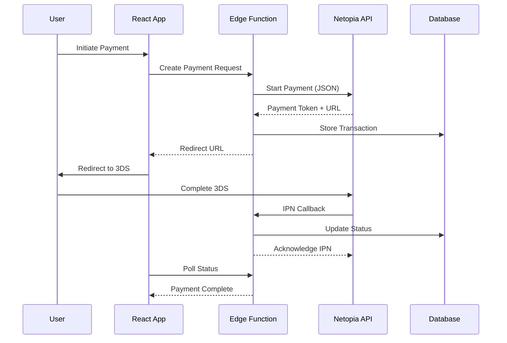

# Netopia Payments Integration Analysis for Pro-Mac Tiles E-commerce Platform

## Executive Summary

This document provides a comprehensive analysis of integrating **Netopia Payments** (Romania's largest payment processor) with the Pro-Mac Tiles e-commerce platform built on React 18, TypeScript, Material-UI, and Supabase. The analysis covers technical feasibility, implementation complexity, testing strategies, and critical considerations for production deployment.

---

## Table of Contents

1. [Architecture Compatibility Assessment](#architecture-compatibility-assessment)
2. [Implementation Difficulty Analysis](#implementation-difficulty-analysis)
3. [Technical Integration Architecture](#technical-integration-architecture)
4. [Testing Strategy & Best Practices](#testing-strategy--best-practices)
5. [Common Corner Cases & Error Handling](#common-corner-cases--error-handling)
6. [Security Considerations](#security-considerations)
7. [Implementation Roadmap](#implementation-roadmap)
8. [Key Findings & Recommendations](#key-findings--recommendations)

---

## Architecture Compatibility Assessment

### Current Pro-Mac Tiles Architecture

```
Frontend: React 18 + TypeScript + Material-UI
Backend: Supabase (PostgreSQL + Auth + Storage + Edge Functions)
State Management: Zustand + React Query
API Layer: Supabase REST API + RLS
```

### Netopia Payments API v2 Architecture

```
API Type: RESTful JSON API
Authentication: Token-based (API Key + Signature)
Protocol: HTTPS with webhook callbacks
Environment: Sandbox + Production
Currency Support: RON (Romanian Lei)
```

### Compatibility Score: ✅ **9/10 - Excellent**

**Strengths:**
- ✅ **JSON-based communication** perfectly aligns with React/TypeScript
- ✅ **Webhook support** integrates seamlessly with Supabase Edge Functions
- ✅ **Token authentication** compatible with secure environment variables
- ✅ **Async payment flow** matches React Query's async state management
- ✅ **RON currency** native support for Romanian market

**Challenges:**
- ⚠️ No official React/TypeScript SDK (requires custom implementation)
- ⚠️ Limited documentation for modern JavaScript frameworks
- ⚠️ IPN callbacks require server-side processing (Edge Functions needed)

---

## Implementation Difficulty Analysis

### For Claude Sonnet: **Medium-High Complexity**

**Complexity Breakdown:**

| Component | Difficulty | Time Estimate | Sonnet Capability |
|-----------|------------|---------------|-------------------|
| API Client Creation | Medium | 2-3 days | ✅ Excellent |
| Payment Flow UI | Low | 1-2 days | ✅ Excellent |
| 3DS Authentication | High | 3-4 days | ⚠️ Good with guidance |
| IPN Handler (Edge Function) | Medium | 2-3 days | ✅ Very Good |
| Error Handling | Medium | 2 days | ✅ Excellent |
| Testing Suite | Medium | 3-4 days | ✅ Very Good |
| **Total Implementation** | **Medium-High** | **13-18 days** | **✅ Achievable** |

### Key Implementation Challenges for Sonnet

1. **No TypeScript Types** - Must create custom type definitions
2. **3DS Flow Complexity** - Multi-step authentication requires careful state management
3. **IPN Signature Verification** - Cryptographic validation in Edge Functions
4. **Transaction State Machine** - Complex status transitions require robust handling

---

## Technical Integration Architecture

### Proposed Architecture

```typescript
// 1. Frontend Layer (React + TypeScript)
├── components/
│   ├── payment/
│   │   ├── PaymentForm.tsx          // Card input with validation
│   │   ├── PaymentStatus.tsx        // Real-time status updates
│   │   └── ThreeDSModal.tsx         // 3DS authentication frame
│   └── checkout/
│       ├── CheckoutSummary.tsx      // Order review
│       └── CheckoutFlow.tsx         // Multi-step checkout
│
├── services/
│   ├── netopia/
│   │   ├── NetopiaClient.ts         // API client wrapper
│   │   ├── types.ts                 // TypeScript definitions
│   │   └── validators.ts            // Input validation
│   └── payment/
│       └── PaymentService.ts        // Payment orchestration
│
└── hooks/
    ├── usePayment.ts                 // Payment state management
    └── usePaymentStatus.ts           // Real-time status polling

// 2. Backend Layer (Supabase)
├── supabase/
│   ├── functions/
│   │   ├── netopia-start/           // Initialize payment
│   │   ├── netopia-ipn/             // IPN webhook handler
│   │   └── netopia-status/          // Check payment status
│   └── migrations/
│       └── 004_payment_tables.sql   // Payment tracking schema

// 3. Database Schema
├── tables/
│   ├── payment_transactions
│   ├── payment_logs
│   └── payment_methods
```

### Payment Flow Sequence



### Key Integration Points

#### 1. Payment Initialization (Edge Function)

```typescript
// supabase/functions/netopia-start/index.ts
import { serve } from 'https://deno.land/std@0.168.0/http/server.ts'
import { createClient } from 'https://esm.sh/@supabase/supabase-js@2'
import * as crypto from 'https://deno.land/std@0.168.0/crypto/mod.ts'

interface NetopiaPaymentRequest {
  amount: number
  currency: string
  orderId: string
  customer: {
    email: string
    firstName: string
    lastName: string
    phone: string
  }
  products: Array<{
    name: string
    price: number
    quantity: number
  }>
  notifyUrl: string
  redirectUrl: string
}

serve(async (req) => {
  const { amount, orderId, customer, products } = await req.json()
  
  const apiKey = Deno.env.get('NETOPIA_API_KEY')!
  const signature = Deno.env.get('NETOPIA_SIGNATURE')!
  
  // Generate payment token
  const timestamp = Date.now().toString()
  const hash = await crypto.subtle.digest(
    'SHA-256',
    new TextEncoder().encode(`${apiKey}${orderId}${timestamp}${signature}`)
  )
  
  const paymentRequest: NetopiaPaymentRequest = {
    amount: amount * 100, // Convert to smallest unit (bani)
    currency: 'RON',
    orderId,
    customer,
    products,
    notifyUrl: `${Deno.env.get('SUPABASE_URL')}/functions/v1/netopia-ipn`,
    redirectUrl: `${Deno.env.get('FRONTEND_URL')}/payment/complete`
  }
  
  // Call Netopia API v2
  const response = await fetch('https://secure.netopia-payments.com/api/v2/payment/start', {
    method: 'POST',
    headers: {
      'Authorization': `Bearer ${apiKey}`,
      'Content-Type': 'application/json',
      'X-Signature': signature
    },
    body: JSON.stringify(paymentRequest)
  })
  
  const result = await response.json()
  
  // Store in database
  const supabase = createClient(
    Deno.env.get('SUPABASE_URL')!,
    Deno.env.get('SUPABASE_SERVICE_ROLE_KEY')!
  )
  
  await supabase.from('payment_transactions').insert({
    order_id: orderId,
    payment_token: result.token,
    amount,
    status: 'pending',
    created_at: new Date().toISOString()
  })
  
  return new Response(JSON.stringify({
    paymentUrl: result.paymentUrl,
    token: result.token
  }), {
    headers: { 'Content-Type': 'application/json' }
  })
})
```

#### 2. IPN Handler (Critical for Payment Confirmation)

```typescript
// supabase/functions/netopia-ipn/index.ts
serve(async (req) => {
  const payload = await req.json()
  
  // Verify IPN signature
  const signature = req.headers.get('X-Netopia-Signature')
  const isValid = await verifySignature(payload, signature)
  
  if (!isValid) {
    return new Response('Invalid signature', { status: 401 })
  }
  
  // Extract payment status
  const { orderId, status, errorCode, errorMessage } = payload
  
  // Map Netopia status codes to internal status
  const statusMap: Record<number, string> = {
    3: 'completed',     // Payment successful
    0: 'approved',      // Approved but not captured
    15: 'pending_3ds',  // Requires 3DS
    16: 'risk_review',  // Under risk assessment
    20: 'failed'        // Payment failed
  }
  
  const internalStatus = statusMap[status] || 'unknown'
  
  // Update database
  await supabase
    .from('payment_transactions')
    .update({
      status: internalStatus,
      error_code: errorCode,
      error_message: errorMessage,
      updated_at: new Date().toISOString()
    })
    .eq('order_id', orderId)
  
  // Log for audit
  await supabase.from('payment_logs').insert({
    order_id: orderId,
    event_type: 'ipn_received',
    payload,
    created_at: new Date().toISOString()
  })
  
  // Return XML acknowledgment (Netopia requirement)
  const xmlResponse = `<?xml version="1.0" encoding="utf-8"?>
    <crc error_code="0">
      <message>success</message>
    </crc>`
  
  return new Response(xmlResponse, {
    headers: { 'Content-Type': 'text/xml' }
  })
})
```

---

## Testing Strategy & Best Practices

### 1. Environment Setup

```typescript
// .env.local (Development)
VITE_NETOPIA_ENV=sandbox
VITE_NETOPIA_MERCHANT_ID=test_merchant
VITE_NETOPIA_PUBLIC_KEY=sandbox_public_key

// .env.production (Production)
VITE_NETOPIA_ENV=live
VITE_NETOPIA_MERCHANT_ID=real_merchant_id
VITE_NETOPIA_PUBLIC_KEY=live_public_key
```

### 2. Test Card Numbers (Sandbox)

| Scenario | Card Number | CVV | Expiry | Expected Result |
|----------|------------|-----|--------|-----------------|
| Successful Payment | 4111 1111 1111 1111 | 123 | 12/25 | Status 3, Error 0 |
| 3DS Required | 5555 5555 5555 4444 | 123 | 12/25 | Status 15, Error 100 |
| Insufficient Funds | 4000 0000 0000 0002 | 123 | 12/25 | Status 20, Error 51 |
| Card Declined | 4000 0000 0000 0069 | 123 | 12/25 | Status 20, Error 5 |
| Risk Assessment | 4000 0000 0000 0127 | 123 | 12/25 | Status 16, Error 0 |

### 3. Automated Testing Suite

```typescript
// tests/payment-integration.spec.ts
import { test, expect } from '@playwright/test'

test.describe('Netopia Payment Integration', () => {
  test.beforeEach(async ({ page }) => {
    // Setup test environment
    await page.addInitScript(() => {
      window.localStorage.setItem('NETOPIA_ENV', 'sandbox')
    })
  })
  
  test('successful payment flow', async ({ page }) => {
    // Navigate to checkout
    await page.goto('/checkout')
    
    // Fill payment form
    await page.fill('[data-testid="card-number"]', '4111111111111111')
    await page.fill('[data-testid="card-cvv"]', '123')
    await page.fill('[data-testid="card-expiry"]', '12/25')
    
    // Submit payment
    await page.click('[data-testid="pay-button"]')
    
    // Wait for redirect to 3DS (if applicable)
    await page.waitForURL(/secure\.netopia-payments\.com/, { timeout: 10000 })
    
    // Complete 3DS simulation
    await page.click('[data-testid="3ds-confirm"]')
    
    // Verify success page
    await expect(page).toHaveURL('/payment/success')
    await expect(page.locator('[data-testid="payment-status"]')).toContainText('Plată finalizată')
  })
  
  test('handles 3DS authentication', async ({ page }) => {
    await page.goto('/checkout')
    await page.fill('[data-testid="card-number"]', '5555555555554444')
    // ... rest of 3DS test
  })
  
  test('handles payment failure gracefully', async ({ page }) => {
    await page.goto('/checkout')
    await page.fill('[data-testid="card-number"]', '4000000000000002')
    // ... test failure handling
  })
})
```

### 4. IPN Testing Strategy

```typescript
// tests/ipn-handler.test.ts
import { describe, it, expect } from 'vitest'
import { testIPN } from '../utils/test-helpers'

describe('IPN Handler', () => {
  it('processes successful payment IPN', async () => {
    const ipnPayload = {
      orderId: 'TEST-001',
      status: 3,
      errorCode: 0,
      amount: 100.00,
      currency: 'RON'
    }
    
    const response = await testIPN(ipnPayload)
    expect(response.status).toBe(200)
    
    // Verify database update
    const transaction = await getTransaction('TEST-001')
    expect(transaction.status).toBe('completed')
  })
  
  it('handles duplicate IPN gracefully', async () => {
    // Send same IPN twice
    await testIPN(payload)
    const response = await testIPN(payload)
    expect(response.status).toBe(200) // Should still acknowledge
  })
  
  it('rejects invalid signature', async () => {
    const response = await testIPN(payload, 'invalid-signature')
    expect(response.status).toBe(401)
  })
})
```

### 5. Load Testing Recommendations

```bash
# Use k6 for load testing payment endpoints
k6 run --vus 10 --duration 30s payment-load-test.js

# Monitor:
# - Response times < 2s for payment initialization
# - IPN processing < 500ms
# - Database connection pool usage
# - Edge Function cold starts
```

---

## Common Corner Cases & Error Handling

### 1. Critical Corner Cases

| Scenario | Cause | Solution | Implementation |
|----------|-------|----------|----------------|
| **Double Payment** | User refreshes during processing | Idempotency keys | Store and check payment tokens |
| **IPN Timeout** | Network issues | Retry mechanism | Netopia retries failed IPNs automatically |
| **3DS Abandonment** | User closes 3DS window | Timeout handling | Poll status, cancel after 15 min |
| **Currency Mismatch** | Wrong amount calculation | Validation | Always use smallest unit (bani) |
| **Partial Refunds** | Customer service requests | API support | Implement refund endpoint |
| **Card Expiry During Checkout** | Long checkout process | Real-time validation | Check expiry before submission |
| **Browser Back Button** | Navigation during payment | State persistence | Use sessionStorage for payment state |
| **Network Interruption** | Connection lost during 3DS | Recovery flow | Resume URL with payment token |

### 2. Error Handling Matrix

```typescript
// services/payment/error-handler.ts
export class PaymentErrorHandler {
  private static errorMap: Record<number, PaymentError> = {
    0: { severity: 'success', message: 'Tranzacție aprobată', action: 'complete' },
    5: { severity: 'error', message: 'Card refuzat', action: 'retry_different_card' },
    51: { severity: 'error', message: 'Fonduri insuficiente', action: 'retry_different_card' },
    54: { severity: 'error', message: 'Card expirat', action: 'update_card' },
    57: { severity: 'warning', message: 'Tranzacție nepermisă', action: 'contact_support' },
    61: { severity: 'warning', message: 'Limită depășită', action: 'reduce_amount' },
    96: { severity: 'error', message: 'Eroare sistem', action: 'retry_later' },
    100: { severity: 'info', message: 'Autentificare 3DS necesară', action: 'redirect_3ds' }
  }
  
  static handle(errorCode: number): PaymentError {
    return this.errorMap[errorCode] || {
      severity: 'error',
      message: 'Eroare neașteptată. Vă rugăm încercați din nou.',
      action: 'retry'
    }
  }
  
  static async logError(error: PaymentError, context: any) {
    // Send to Supabase logs
    await supabase.from('payment_errors').insert({
      error_code: error.code,
      error_message: error.message,
      context,
      created_at: new Date().toISOString()
    })
    
    // Alert admin for critical errors
    if (error.severity === 'critical') {
      await sendAdminAlert(error)
    }
  }
}
```

### 3. State Recovery Patterns

```typescript
// hooks/usePaymentRecovery.ts
export function usePaymentRecovery() {
  const [paymentState, setPaymentState] = useState<PaymentState>()
  
  useEffect(() => {
    // Recover from sessionStorage
    const stored = sessionStorage.getItem('payment_state')
    if (stored) {
      const state = JSON.parse(stored)
      // Check if still valid (< 30 min old)
      if (Date.now() - state.timestamp < 30 * 60 * 1000) {
        setPaymentState(state)
      }
    }
  }, [])
  
  const saveState = useCallback((state: PaymentState) => {
    sessionStorage.setItem('payment_state', JSON.stringify({
      ...state,
      timestamp: Date.now()
    }))
    setPaymentState(state)
  }, [])
  
  return { paymentState, saveState }
}
```

---

## Security Considerations

### 1. Critical Security Requirements

#### API Key Management
```typescript
// ❌ NEVER DO THIS
const API_KEY = "sk_live_xxxxx" // Exposed in frontend

// ✅ CORRECT APPROACH
// Store in Edge Function environment variables
const apiKey = Deno.env.get('NETOPIA_API_KEY')
```

#### PCI DSS Compliance
- **Never store card details** in your database
- Use Netopia's hosted payment page for card input
- Implement Content Security Policy (CSP) headers
- Use HTTPS everywhere
- Log security events for audit

#### HMAC Signature Verification
```typescript
// Edge Function signature verification
async function verifySignature(
  payload: any, 
  receivedSignature: string
): Promise<boolean> {
  const secret = Deno.env.get('NETOPIA_SIGNATURE')!
  const message = JSON.stringify(payload)
  
  const encoder = new TextEncoder()
  const key = await crypto.subtle.importKey(
    'raw',
    encoder.encode(secret),
    { name: 'HMAC', hash: 'SHA-256' },
    false,
    ['verify']
  )
  
  const signature = encoder.encode(receivedSignature)
  const data = encoder.encode(message)
  
  return await crypto.subtle.verify('HMAC', key, signature, data)
}
```

### 2. RLS Policies for Payment Tables

```sql
-- Only authenticated users can view their own transactions
CREATE POLICY "Users can view own transactions" ON payment_transactions
  FOR SELECT USING (auth.uid() = user_id);

-- Only service role can insert/update transactions
CREATE POLICY "Service role manages transactions" ON payment_transactions
  FOR ALL USING (auth.role() = 'service_role');

-- Audit log is append-only
CREATE POLICY "Append only payment logs" ON payment_logs
  FOR INSERT WITH CHECK (true);
```

### 3. Rate Limiting & DDoS Protection

```typescript
// Edge Function rate limiting
const rateLimiter = new Map<string, number[]>()

function checkRateLimit(ip: string, limit = 10, window = 60000): boolean {
  const now = Date.now()
  const requests = rateLimiter.get(ip) || []
  
  // Remove old requests outside window
  const recent = requests.filter(time => now - time < window)
  
  if (recent.length >= limit) {
    return false // Rate limit exceeded
  }
  
  recent.push(now)
  rateLimiter.set(ip, recent)
  return true
}
```

---

## Implementation Roadmap

### Phase 1: Foundation (Week 1)
- [ ] Create TypeScript type definitions for Netopia API
- [ ] Set up payment database tables and RLS policies
- [ ] Implement basic Edge Functions structure
- [ ] Configure sandbox environment variables

### Phase 2: Core Integration (Week 2)
- [ ] Build payment initialization flow
- [ ] Implement IPN handler with signature verification
- [ ] Create payment status polling mechanism
- [ ] Add error handling and logging

### Phase 3: UI Components (Week 3)
- [ ] Design checkout flow UI with Material-UI
- [ ] Implement payment form with validation
- [ ] Add 3DS authentication modal
- [ ] Create payment status page

### Phase 4: Testing & Hardening (Week 4)
- [ ] Write comprehensive Playwright tests
- [ ] Implement all corner case handlers
- [ ] Load test Edge Functions
- [ ] Security audit and PCI compliance check

### Phase 5: Production Preparation (Week 5)
- [ ] Switch to production credentials
- [ ] Set up monitoring and alerting
- [ ] Create admin dashboard for payment management
- [ ] Document deployment process

---

## Key Findings & Recommendations

### ✅ Strengths of Integration

1. **Excellent Architecture Fit** - Netopia's JSON API aligns perfectly with React/TypeScript/Supabase stack
2. **Native Romanian Support** - RON currency and local payment methods fully supported
3. **Robust Webhook System** - IPN callbacks provide reliable payment confirmation
4. **Comprehensive Testing** - Sandbox environment with test cards enables thorough testing

### ⚠️ Challenges to Address

1. **No Official SDK** - Requires custom TypeScript implementation
2. **Documentation Gaps** - Limited examples for modern JavaScript frameworks
3. **3DS Complexity** - Multi-step authentication needs careful UX design
4. **XML IPN Response** - Unusual requirement for XML acknowledgment in modern API

### 🎯 Recommendations

1. **Start with MVP** - Implement basic card payments first, add advanced features later
2. **Use Edge Functions** - Leverage Supabase Edge Functions for all server-side operations
3. **Implement Idempotency** - Prevent duplicate payments with robust token management
4. **Monitor Extensively** - Log all payment events for debugging and compliance
5. **Plan for Failure** - Design UI for all error scenarios from day one

### 📊 Success Metrics

- Payment success rate > 95%
- 3DS completion rate > 80%  
- IPN processing time < 500ms
- Zero security incidents
- PCI DSS compliance maintained

### 🔮 Future Enhancements

1. **Saved Cards** - Token vault for returning customers
2. **Subscription Payments** - Recurring billing support
3. **Alternative Payment Methods** - PayPal, Google Pay, Apple Pay
4. **Advanced Fraud Detection** - ML-based risk scoring
5. **Multi-currency Support** - EUR, USD for international customers

---

## Conclusion

Integrating Netopia Payments with the Pro-Mac Tiles platform is **technically feasible and recommended**. The architecture alignment is strong, and while some challenges exist (no official SDK, 3DS complexity), they are manageable with proper planning and implementation.

**Estimated Total Implementation Time: 4-5 weeks** for a production-ready integration with comprehensive testing and security measures.

The combination of Supabase Edge Functions for server-side processing and React Query for client-side state management provides an excellent foundation for building a robust, scalable payment system that can grow with the business.

---

## Appendix A: Useful Resources

- [Netopia API v2 Documentation](https://doc.netopia-payments.com/docs/payment-api/v2.x/introduction/)
- [Netopia Sandbox Portal](https://secure.sandbox.netopia-payments.com/)
- [Supabase Edge Functions Guide](https://supabase.com/docs/guides/functions)
- [PCI DSS Compliance Checklist](https://www.pcisecuritystandards.org/)
- [Netopia GitHub Repositories](https://github.com/mobilpay)

## Appendix B: Contact Information

- **Netopia Technical Support**: support@netopia-payments.com
- **API Status Page**: https://netopia-payments.com/status-platforma/
- **Developer Portal**: https://doc.netopia-payments.com/

---

*Document Version: 1.0*  
*Last Updated: September 2025*  
*Author: Claude AI Assistant*  
*For: Pro-Mac Tiles E-commerce Platform*