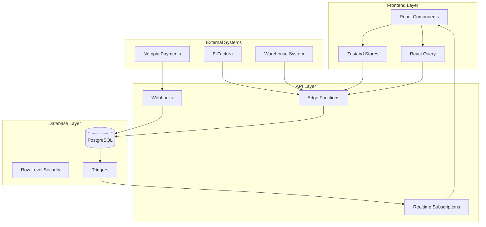

# Stock Management Implementation Guide for Pro-Mac Tiles E-commerce Platform

## Executive Summary

This comprehensive guide provides a detailed implementation plan for a robust, scalable stock management system for the Pro-Mac Tiles e-commerce platform. The system addresses real-time inventory tracking, concurrent transaction handling, multi-warehouse support, and integration with existing payment and invoice systems. This guide leverages the existing React 18 + TypeScript + Supabase architecture while introducing advanced patterns for handling the complexities of tile inventory management.

---

## Table of Contents

1. [Current State Analysis](#current-state-analysis)
2. [Architecture Design](#architecture-design)
3. [Database Schema Enhancement](#database-schema-enhancement)
4. [Core Features Implementation](#core-features-implementation)
5. [Concurrency & Race Condition Handling](#concurrency--race-condition-handling)
6. [Integration Points](#integration-points)
7. [Testing Strategy](#testing-strategy)
8. [Task Breakdown & Implementation Phases](#task-breakdown--implementation-phases)
9. [Subagent Recommendations](#subagent-recommendations)
10. [Best Practices & Tips](#best-practices--tips)
11. [Potential Issues & Mitigation](#potential-issues--mitigation)
12. [Performance Optimization](#performance-optimization)
13. [Monitoring & Analytics](#monitoring--analytics)

---

## Current State Analysis

### Existing Infrastructure
```typescript
// Current simplified structure
- Products table: stock_quantity (decimal) field
- Cart system: Zustand store with localStorage persistence
- No dedicated inventory tracking
- No stock reservation mechanism
- No multi-location support
- No audit trail for stock movements
```

### Identified Gaps
1. **No Stock Reservation** - Risk of overselling during concurrent purchases
2. **No Movement Tracking** - Cannot trace stock history
3. **Single Location** - No support for multiple warehouses/showrooms
4. **No Reorder Automation** - Manual stock replenishment
5. **Limited Unit Support** - Only m² tracking, no box/piece conversion
6. **No Batch/Lot Tracking** - Cannot track different shipments
7. **No Stock Alerts** - No notifications for low stock
8. **No Return Handling** - No system for managing returns/damages

---

## Architecture Design

### High-Level Architecture



### Component Architecture

```typescript
// Frontend Components Structure
├── components/
│   ├── stock/
│   │   ├── StockOverview.tsx           // Dashboard widget
│   │   ├── StockAdjustmentForm.tsx     // Manual adjustments
│   │   ├── StockMovementHistory.tsx    // Audit trail view
│   │   ├── LowStockAlerts.tsx          // Alert management
│   │   ├── StockTransferForm.tsx       // Between locations
│   │   └── BatchManagement.tsx         // Batch/lot tracking
│   ├── inventory/
│   │   ├── InventoryDashboard.tsx      // Main inventory view
│   │   ├── ReorderSuggestions.tsx      // Smart reordering
│   │   ├── StockValuation.tsx          // Financial view
│   │   └── InventoryReports.tsx        // Analytics
│   └── warehouse/
│       ├── WarehouseManager.tsx        // Multi-location
│       ├── ReceivingForm.tsx           // Stock intake
│       └── PickingList.tsx             // Order fulfillment

// Backend Structure
├── supabase/functions/
│   ├── stock-reserve/                  // Reserve stock for orders
│   ├── stock-release/                  // Release reserved stock
│   ├── stock-adjust/                   // Manual adjustments
│   ├── stock-transfer/                 // Between locations
│   ├── stock-check/                    // Availability checker
│   ├── stock-sync/                     // External sync
│   └── stock-alerts/                   // Low stock notifications

// Store Structure
├── stores/
│   ├── inventory.ts                    // Main inventory store
│   ├── stockMovements.ts               // Movement tracking
│   ├── warehouses.ts                   // Location management
│   └── stockAlerts.ts                  // Alert management
```

---

## Database Schema Enhancement

### Core Tables Design

```sql
-- ============================================
-- 1. ENHANCED INVENTORY TABLE
-- ============================================
CREATE TABLE inventory (
    id UUID DEFAULT gen_random_uuid() PRIMARY KEY,
    product_id INTEGER REFERENCES products(id) ON DELETE CASCADE,
    warehouse_id UUID REFERENCES warehouses(id),
    
    -- Stock quantities (all in smallest unit - pieces/tiles)
    quantity_on_hand DECIMAL(10,2) NOT NULL DEFAULT 0,
    quantity_reserved DECIMAL(10,2) NOT NULL DEFAULT 0,
    quantity_available DECIMAL(10,2) GENERATED ALWAYS AS 
        (quantity_on_hand - quantity_reserved) STORED,
    
    -- Unit conversions
    pieces_per_box INTEGER NOT NULL DEFAULT 1,
    sqm_per_box DECIMAL(8,4) NOT NULL DEFAULT 1,
    pieces_per_sqm DECIMAL(8,4) GENERATED ALWAYS AS 
        (pieces_per_box / NULLIF(sqm_per_box, 0)) STORED,
    
    -- Reorder points
    reorder_point DECIMAL(10,2),
    reorder_quantity DECIMAL(10,2),
    max_stock_level DECIMAL(10,2),
    
    -- Location details
    bin_location VARCHAR(50),
    zone VARCHAR(20),
    
    -- Tracking
    last_counted_at TIMESTAMP WITH TIME ZONE,
    last_restock_at TIMESTAMP WITH TIME ZONE,
    
    -- Metadata
    created_at TIMESTAMP WITH TIME ZONE DEFAULT NOW(),
    updated_at TIMESTAMP WITH TIME ZONE DEFAULT NOW(),
    
    -- Constraints
    UNIQUE(product_id, warehouse_id),
    CHECK (quantity_on_hand >= 0),
    CHECK (quantity_reserved >= 0),
    CHECK (quantity_reserved <= quantity_on_hand)
);

-- ============================================
-- 2. STOCK MOVEMENTS TABLE (Audit Trail)
-- ============================================
CREATE TABLE stock_movements (
    id UUID DEFAULT gen_random_uuid() PRIMARY KEY,
    movement_type VARCHAR(50) NOT NULL,
    /* Types: 
       'purchase', 'sale', 'return', 'adjustment', 
       'transfer_in', 'transfer_out', 'damage', 
       'count_adjustment', 'reservation', 'release'
    */
    
    -- References
    product_id INTEGER REFERENCES products(id),
    from_warehouse_id UUID REFERENCES warehouses(id),
    to_warehouse_id UUID REFERENCES warehouses(id),
    order_id UUID REFERENCES orders(id),
    
    -- Quantities (positive for IN, negative for OUT)
    quantity DECIMAL(10,2) NOT NULL,
    unit_of_measure VARCHAR(20) NOT NULL DEFAULT 'piece',
    
    -- Financial
    unit_cost DECIMAL(10,2),
    total_cost DECIMAL(10,2),
    
    -- Batch tracking
    batch_number VARCHAR(100),
    lot_number VARCHAR(100),
    expiry_date DATE,
    
    -- Status and validation
    status VARCHAR(20) DEFAULT 'pending',
    /* Status: 'pending', 'completed', 'cancelled', 'failed' */
    
    -- User tracking
    performed_by UUID REFERENCES auth.users(id),
    approved_by UUID REFERENCES auth.users(id),
    
    -- Notes and reason
    reason VARCHAR(200),
    notes TEXT,
    
    -- Reference to external systems
    external_ref VARCHAR(100),
    external_system VARCHAR(50),
    
    -- Timestamps
    movement_date TIMESTAMP WITH TIME ZONE DEFAULT NOW(),
    created_at TIMESTAMP WITH TIME ZONE DEFAULT NOW(),
    
    -- Indexes for performance
    INDEX idx_movement_product (product_id),
    INDEX idx_movement_date (movement_date),
    INDEX idx_movement_type (movement_type),
    INDEX idx_movement_status (status)
);

-- ============================================
-- 3. WAREHOUSES/LOCATIONS TABLE
-- ============================================
CREATE TABLE warehouses (
    id UUID DEFAULT gen_random_uuid() PRIMARY KEY,
    code VARCHAR(20) UNIQUE NOT NULL,
    name VARCHAR(100) NOT NULL,
    type VARCHAR(50) NOT NULL DEFAULT 'warehouse',
    /* Types: 'warehouse', 'showroom', 'supplier', 'transit' */
    
    -- Address
    address TEXT,
    city VARCHAR(100),
    county VARCHAR(100),
    postal_code VARCHAR(20),
    country VARCHAR(2) DEFAULT 'RO',
    
    -- Contact
    phone VARCHAR(50),
    email VARCHAR(100),
    manager_id UUID REFERENCES auth.users(id),
    
    -- Capabilities
    can_ship BOOLEAN DEFAULT true,
    can_receive BOOLEAN DEFAULT true,
    is_default BOOLEAN DEFAULT false,
    
    -- Status
    is_active BOOLEAN DEFAULT true,
    
    -- Metadata
    created_at TIMESTAMP WITH TIME ZONE DEFAULT NOW(),
    updated_at TIMESTAMP WITH TIME ZONE DEFAULT NOW()
);

-- ============================================
-- 4. STOCK RESERVATIONS TABLE
-- ============================================
CREATE TABLE stock_reservations (
    id UUID DEFAULT gen_random_uuid() PRIMARY KEY,
    
    -- References
    product_id INTEGER REFERENCES products(id),
    warehouse_id UUID REFERENCES warehouses(id),
    order_id UUID REFERENCES orders(id),
    cart_session_id VARCHAR(100),
    
    -- Reservation details
    quantity DECIMAL(10,2) NOT NULL,
    unit_price DECIMAL(10,2),
    
    -- Timing
    reserved_at TIMESTAMP WITH TIME ZONE DEFAULT NOW(),
    expires_at TIMESTAMP WITH TIME ZONE NOT NULL,
    released_at TIMESTAMP WITH TIME ZONE,
    
    -- Status
    status VARCHAR(20) DEFAULT 'active',
    /* Status: 'active', 'confirmed', 'released', 'expired' */
    
    -- User reference
    user_id UUID REFERENCES auth.users(id),
    
    -- Constraints
    CHECK (quantity > 0),
    CHECK (expires_at > reserved_at)
);

-- ============================================
-- 5. STOCK ALERTS TABLE
-- ============================================
CREATE TABLE stock_alerts (
    id UUID DEFAULT gen_random_uuid() PRIMARY KEY,
    
    -- Alert configuration
    alert_type VARCHAR(50) NOT NULL,
    /* Types: 'low_stock', 'out_of_stock', 'overstock', 'expiring' */
    
    product_id INTEGER REFERENCES products(id),
    warehouse_id UUID REFERENCES warehouses(id),
    
    -- Thresholds
    threshold_value DECIMAL(10,2),
    current_value DECIMAL(10,2),
    
    -- Alert details
    severity VARCHAR(20) DEFAULT 'medium',
    /* Severity: 'low', 'medium', 'high', 'critical' */
    
    message TEXT,
    
    -- Status tracking
    is_active BOOLEAN DEFAULT true,
    is_acknowledged BOOLEAN DEFAULT false,
    acknowledged_by UUID REFERENCES auth.users(id),
    acknowledged_at TIMESTAMP WITH TIME ZONE,
    
    -- Resolution
    resolved_at TIMESTAMP WITH TIME ZONE,
    resolution_notes TEXT,
    
    -- Timestamps
    triggered_at TIMESTAMP WITH TIME ZONE DEFAULT NOW(),
    created_at TIMESTAMP WITH TIME ZONE DEFAULT NOW()
);

-- ============================================
-- 6. BATCH TRACKING TABLE
-- ============================================
CREATE TABLE stock_batches (
    id UUID DEFAULT gen_random_uuid() PRIMARY KEY,
    
    -- Identification
    batch_number VARCHAR(100) UNIQUE NOT NULL,
    product_id INTEGER REFERENCES products(id),
    warehouse_id UUID REFERENCES warehouses(id),
    
    -- Quantities
    initial_quantity DECIMAL(10,2) NOT NULL,
    current_quantity DECIMAL(10,2) NOT NULL,
    
    -- Dates
    manufacture_date DATE,
    expiry_date DATE,
    received_date DATE NOT NULL,
    
    -- Source
    supplier_name VARCHAR(200),
    purchase_order_number VARCHAR(100),
    invoice_number VARCHAR(100),
    
    -- Quality
    quality_check_status VARCHAR(50),
    quality_notes TEXT,
    
    -- Cost
    unit_cost DECIMAL(10,2),
    total_cost DECIMAL(10,2),
    
    -- Status
    status VARCHAR(50) DEFAULT 'active',
    
    -- Metadata
    created_at TIMESTAMP WITH TIME ZONE DEFAULT NOW(),
    updated_at TIMESTAMP WITH TIME ZONE DEFAULT NOW()
);
```

### Critical Indexes and Constraints

```sql
-- Performance indexes
CREATE INDEX idx_inventory_product_warehouse ON inventory(product_id, warehouse_id);
CREATE INDEX idx_inventory_available ON inventory(quantity_available) 
    WHERE quantity_available > 0;
CREATE INDEX idx_reservations_expires ON stock_reservations(expires_at) 
    WHERE status = 'active';
CREATE INDEX idx_movements_date_product ON stock_movements(movement_date DESC, product_id);
CREATE INDEX idx_alerts_active ON stock_alerts(product_id, is_active) 
    WHERE is_active = true;

-- Ensure data integrity
ALTER TABLE inventory ADD CONSTRAINT positive_quantities 
    CHECK (quantity_on_hand >= 0 AND quantity_reserved >= 0);
ALTER TABLE stock_movements ADD CONSTRAINT valid_movement_type 
    CHECK (movement_type IN ('purchase', 'sale', 'return', 'adjustment', 
                            'transfer_in', 'transfer_out', 'damage', 
                            'count_adjustment', 'reservation', 'release'));
```

---

## Core Features Implementation

### 1. Real-time Stock Tracking

```typescript
// hooks/useRealTimeStock.ts
import { useEffect, useState } from 'react'
import { RealtimeChannel } from '@supabase/supabase-js'
import { supabase } from '@/lib/supabase'

export function useRealTimeStock(productId: number) {
  const [stock, setStock] = useState<StockLevel | null>(null)
  const [isLoading, setIsLoading] = useState(true)
  
  useEffect(() => {
    let channel: RealtimeChannel
    
    const setupRealtimeSubscription = async () => {
      // Initial fetch
      const { data } = await supabase
        .from('inventory')
        .select('*')
        .eq('product_id', productId)
        .single()
      
      setStock(data)
      setIsLoading(false)
      
      // Subscribe to changes
      channel = supabase
        .channel(`stock_${productId}`)
        .on(
          'postgres_changes',
          {
            event: '*',
            schema: 'public',
            table: 'inventory',
            filter: `product_id=eq.${productId}`
          },
          (payload) => {
            console.log('Stock change:', payload)
            setStock(payload.new as StockLevel)
          }
        )
        .on(
          'postgres_changes',
          {
            event: 'INSERT',
            schema: 'public',
            table: 'stock_movements',
            filter: `product_id=eq.${productId}`
          },
          async (payload) => {
            // Refetch stock after movement
            const { data } = await supabase
              .from('inventory')
              .select('*')
              .eq('product_id', productId)
              .single()
            setStock(data)
          }
        )
        .subscribe()
    }
    
    setupRealtimeSubscription()
    
    return () => {
      if (channel) {
        supabase.removeChannel(channel)
      }
    }
  }, [productId])
  
  return { stock, isLoading }
}
```

### 2. Stock Reservation System

```typescript
// supabase/functions/stock-reserve/index.ts
import { serve } from 'https://deno.land/std@0.168.0/http/server.ts'
import { createClient } from 'https://esm.sh/@supabase/supabase-js@2'

interface ReservationRequest {
  items: Array<{
    product_id: number
    quantity: number
    warehouse_id?: string
  }>
  order_id?: string
  cart_session_id?: string
  user_id: string
  duration_minutes?: number // Default 15 minutes
}

serve(async (req) => {
  const supabase = createClient(
    Deno.env.get('SUPABASE_URL')!,
    Deno.env.get('SUPABASE_SERVICE_ROLE_KEY')!
  )
  
  const request: ReservationRequest = await req.json()
  const reservations: any[] = []
  const failures: any[] = []
  
  // Start transaction
  const { data: transaction, error: txError } = await supabase.rpc(
    'begin_transaction'
  )
  
  if (txError) {
    return new Response(JSON.stringify({ error: 'Transaction failed' }), {
      status: 500
    })
  }
  
  try {
    for (const item of request.items) {
      // Check availability with row-level lock
      const { data: inventory, error: invError } = await supabase
        .from('inventory')
        .select('*')
        .eq('product_id', item.product_id)
        .eq('warehouse_id', item.warehouse_id || 'default')
        .single()
        .lock('FOR UPDATE') // Pessimistic locking
      
      if (invError || !inventory) {
        failures.push({
          product_id: item.product_id,
          reason: 'Product not found'
        })
        continue
      }
      
      // Check if enough stock available
      if (inventory.quantity_available < item.quantity) {
        failures.push({
          product_id: item.product_id,
          reason: 'Insufficient stock',
          available: inventory.quantity_available,
          requested: item.quantity
        })
        continue
      }
      
      // Create reservation
      const expiresAt = new Date()
      expiresAt.setMinutes(
        expiresAt.getMinutes() + (request.duration_minutes || 15)
      )
      
      const { data: reservation, error: resError } = await supabase
        .from('stock_reservations')
        .insert({
          product_id: item.product_id,
          warehouse_id: item.warehouse_id || 'default',
          quantity: item.quantity,
          order_id: request.order_id,
          cart_session_id: request.cart_session_id,
          user_id: request.user_id,
          expires_at: expiresAt.toISOString(),
          status: 'active'
        })
        .select()
        .single()
      
      if (resError) {
        failures.push({
          product_id: item.product_id,
          reason: 'Reservation failed',
          error: resError.message
        })
        continue
      }
      
      // Update inventory
      const { error: updateError } = await supabase
        .from('inventory')
        .update({
          quantity_reserved: inventory.quantity_reserved + item.quantity
        })
        .eq('id', inventory.id)
      
      if (updateError) {
        failures.push({
          product_id: item.product_id,
          reason: 'Inventory update failed'
        })
        continue
      }
      
      // Record movement
      await supabase.from('stock_movements').insert({
        movement_type: 'reservation',
        product_id: item.product_id,
        from_warehouse_id: item.warehouse_id || 'default',
        quantity: -item.quantity, // Negative for reservation
        order_id: request.order_id,
        performed_by: request.user_id,
        reason: 'Stock reserved for order',
        status: 'completed'
      })
      
      reservations.push(reservation)
    }
    
    // Commit or rollback
    if (failures.length > 0 && reservations.length === 0) {
      await supabase.rpc('rollback_transaction')
      return new Response(JSON.stringify({ 
        success: false, 
        failures 
      }), { status: 400 })
    }
    
    await supabase.rpc('commit_transaction')
    
    return new Response(JSON.stringify({
      success: true,
      reservations,
      failures
    }), {
      headers: { 'Content-Type': 'application/json' }
    })
    
  } catch (error) {
    await supabase.rpc('rollback_transaction')
    return new Response(JSON.stringify({ 
      error: error.message 
    }), { status: 500 })
  }
})
```

### 3. Automatic Stock Release for Expired Reservations

```sql
-- Database function for releasing expired reservations
CREATE OR REPLACE FUNCTION release_expired_reservations()
RETURNS void AS $$
BEGIN
  -- Find all expired active reservations
  WITH expired AS (
    SELECT * FROM stock_reservations
    WHERE status = 'active' 
    AND expires_at < NOW()
    FOR UPDATE
  )
  -- Update inventory for each expired reservation
  UPDATE inventory i
  SET quantity_reserved = i.quantity_reserved - e.quantity
  FROM expired e
  WHERE i.product_id = e.product_id 
  AND i.warehouse_id = e.warehouse_id;
  
  -- Mark reservations as expired
  UPDATE stock_reservations
  SET status = 'expired',
      released_at = NOW()
  WHERE status = 'active' 
  AND expires_at < NOW();
  
  -- Log movements
  INSERT INTO stock_movements (
    movement_type, product_id, from_warehouse_id, 
    quantity, reason, status
  )
  SELECT 
    'release', product_id, warehouse_id,
    quantity, 'Reservation expired', 'completed'
  FROM stock_reservations
  WHERE status = 'expired' 
  AND released_at >= NOW() - INTERVAL '1 minute';
END;
$$ LANGUAGE plpgsql;

-- Schedule with pg_cron (run every 5 minutes)
SELECT cron.schedule(
  'release-expired-reservations',
  '*/5 * * * *',
  'SELECT release_expired_reservations();'
);
```

---

## Concurrency & Race Condition Handling

### 1. Pessimistic Locking Strategy

```typescript
// services/stock/concurrency.ts
export class StockConcurrencyManager {
  /**
   * Atomic stock operation with pessimistic locking
   */
  async atomicStockOperation<T>(
    operation: () => Promise<T>,
    retries = 3
  ): Promise<T> {
    let lastError: Error | null = null
    
    for (let i = 0; i < retries; i++) {
      try {
        // Begin transaction with SERIALIZABLE isolation
        await supabase.rpc('begin_transaction', {
          isolation_level: 'SERIALIZABLE'
        })
        
        const result = await operation()
        
        await supabase.rpc('commit_transaction')
        return result
        
      } catch (error) {
        await supabase.rpc('rollback_transaction')
        lastError = error as Error
        
        // Check if it's a serialization failure
        if (error.code === '40001') {
          // Exponential backoff
          await this.delay(Math.pow(2, i) * 100)
          continue
        }
        
        throw error
      }
    }
    
    throw lastError || new Error('Operation failed after retries')
  }
  
  private delay(ms: number): Promise<void> {
    return new Promise(resolve => setTimeout(resolve, ms))
  }
}
```

### 2. Optimistic Locking with Version Control

```sql
-- Add version column to inventory
ALTER TABLE inventory ADD COLUMN version INTEGER DEFAULT 1;

-- Update function with optimistic locking
CREATE OR REPLACE FUNCTION update_inventory_optimistic(
  p_inventory_id UUID,
  p_quantity_change DECIMAL,
  p_expected_version INTEGER
)
RETURNS BOOLEAN AS $$
DECLARE
  v_updated_rows INTEGER;
BEGIN
  UPDATE inventory
  SET 
    quantity_on_hand = quantity_on_hand + p_quantity_change,
    version = version + 1,
    updated_at = NOW()
  WHERE 
    id = p_inventory_id 
    AND version = p_expected_version
    AND quantity_on_hand + p_quantity_change >= 0;
  
  GET DIAGNOSTICS v_updated_rows = ROW_COUNT;
  
  RETURN v_updated_rows > 0;
END;
$$ LANGUAGE plpgsql;
```

### 3. Distributed Lock Implementation

```typescript
// services/stock/distributedLock.ts
export class DistributedLock {
  private lockTable = 'distributed_locks'
  
  async acquireLock(
    resourceId: string,
    lockId: string,
    ttlSeconds = 30
  ): Promise<boolean> {
    try {
      const expiresAt = new Date()
      expiresAt.setSeconds(expiresAt.getSeconds() + ttlSeconds)
      
      const { error } = await supabase
        .from(this.lockTable)
        .insert({
          resource_id: resourceId,
          lock_id: lockId,
          expires_at: expiresAt.toISOString()
        })
      
      return !error
    } catch {
      // Lock already exists
      return false
    }
  }
  
  async releaseLock(resourceId: string, lockId: string): Promise<void> {
    await supabase
      .from(this.lockTable)
      .delete()
      .eq('resource_id', resourceId)
      .eq('lock_id', lockId)
  }
  
  async withLock<T>(
    resourceId: string,
    operation: () => Promise<T>
  ): Promise<T> {
    const lockId = crypto.randomUUID()
    let acquired = false
    
    try {
      // Try to acquire lock with retries
      for (let i = 0; i < 10; i++) {
        acquired = await this.acquireLock(resourceId, lockId)
        if (acquired) break
        await this.delay(100 * Math.pow(2, i))
      }
      
      if (!acquired) {
        throw new Error('Could not acquire lock')
      }
      
      return await operation()
      
    } finally {
      if (acquired) {
        await this.releaseLock(resourceId, lockId)
      }
    }
  }
}
```

---

## Integration Points

### 1. Cart to Order Flow with Stock Validation

```typescript
// services/checkout/stockValidation.ts
export class CheckoutStockValidator {
  async validateAndReserveCart(
    cartItems: CartItem[],
    userId: string
  ): Promise<ValidationResult> {
    const validationResults: ItemValidation[] = []
    
    for (const item of cartItems) {
      // Check real-time availability
      const { data: inventory } = await supabase
        .from('inventory')
        .select('quantity_available')
        .eq('product_id', item.product_id)
        .single()
      
      if (!inventory || inventory.quantity_available < item.quantity) {
        validationResults.push({
          product_id: item.product_id,
          valid: false,
          available: inventory?.quantity_available || 0,
          requested: item.quantity,
          suggestion: this.getSuggestion(inventory, item)
        })
      } else {
        validationResults.push({
          product_id: item.product_id,
          valid: true,
          available: inventory.quantity_available,
          requested: item.quantity
        })
      }
    }
    
    const allValid = validationResults.every(r => r.valid)
    
    if (allValid) {
      // Reserve stock
      const { data: reservations } = await this.reserveStock(
        cartItems,
        userId
      )
      
      return {
        valid: true,
        reservations,
        validationResults
      }
    }
    
    return {
      valid: false,
      validationResults,
      suggestions: this.generateAlternatives(validationResults)
    }
  }
}
```

### 2. Payment Confirmation Hook

```typescript
// supabase/functions/payment-confirmed/index.ts
serve(async (req) => {
  const { order_id, payment_status } = await req.json()
  
  if (payment_status === 'completed') {
    // Convert reservations to actual stock deduction
    const { data: reservations } = await supabase
      .from('stock_reservations')
      .select('*')
      .eq('order_id', order_id)
      .eq('status', 'active')
    
    for (const reservation of reservations) {
      // Update inventory
      await supabase.rpc('confirm_stock_reservation', {
        reservation_id: reservation.id
      })
      
      // Create stock movement
      await supabase.from('stock_movements').insert({
        movement_type: 'sale',
        product_id: reservation.product_id,
        from_warehouse_id: reservation.warehouse_id,
        quantity: -reservation.quantity,
        order_id,
        status: 'completed',
        reason: 'Order confirmed'
      })
    }
    
    // Update order status
    await supabase
      .from('orders')
      .update({ 
        status: 'confirmed',
        stock_allocated: true 
      })
      .eq('id', order_id)
  }
})
```

### 3. E-Factura Integration

```typescript
// Integration with invoice system
export class StockInvoiceIntegration {
  async onInvoiceGenerated(invoice: Invoice) {
    // Verify stock was properly allocated
    for (const line of invoice.lines) {
      const movement = await this.verifyStockMovement(
        line.product_id,
        invoice.order_id
      )
      
      if (!movement) {
        // Alert: Invoice generated without stock allocation
        await this.createStockAlert({
          type: 'invoice_without_stock',
          severity: 'critical',
          product_id: line.product_id,
          order_id: invoice.order_id
        })
      }
    }
  }
}
```

---

## Testing Strategy

### 1. Unit Tests

```typescript
// tests/stock/reservation.test.ts
import { describe, it, expect, beforeEach } from 'vitest'
import { StockReservationService } from '@/services/stock/reservation'

describe('Stock Reservation Service', () => {
  let service: StockReservationService
  
  beforeEach(() => {
    service = new StockReservationService()
    // Reset test database
  })
  
  it('should reserve available stock', async () => {
    // Arrange
    const product = await createTestProduct({ stock: 100 })
    
    // Act
    const reservation = await service.reserve({
      product_id: product.id,
      quantity: 10,
      user_id: 'test-user'
    })
    
    // Assert
    expect(reservation).toBeDefined()
    expect(reservation.status).toBe('active')
    
    const inventory = await getInventory(product.id)
    expect(inventory.quantity_available).toBe(90)
    expect(inventory.quantity_reserved).toBe(10)
  })
  
  it('should handle concurrent reservations', async () => {
    const product = await createTestProduct({ stock: 10 })
    
    // Simulate concurrent requests
    const promises = Array(5).fill(null).map(() =>
      service.reserve({
        product_id: product.id,
        quantity: 3,
        user_id: 'test-user'
      })
    )
    
    const results = await Promise.allSettled(promises)
    
    // Only 3 should succeed (10 stock / 3 quantity = 3 successful)
    const successful = results.filter(r => r.status === 'fulfilled')
    expect(successful).toHaveLength(3)
    
    const inventory = await getInventory(product.id)
    expect(inventory.quantity_reserved).toBe(9)
    expect(inventory.quantity_available).toBe(1)
  })
  
  it('should release expired reservations', async () => {
    const product = await createTestProduct({ stock: 100 })
    
    // Create reservation with 1 second expiry
    const reservation = await service.reserve({
      product_id: product.id,
      quantity: 10,
      user_id: 'test-user',
      duration_seconds: 1
    })
    
    // Wait for expiry
    await delay(1500)
    
    // Run cleanup
    await service.releaseExpired()
    
    // Check reservation released
    const updated = await getReservation(reservation.id)
    expect(updated.status).toBe('expired')
    
    const inventory = await getInventory(product.id)
    expect(inventory.quantity_available).toBe(100)
    expect(inventory.quantity_reserved).toBe(0)
  })
})
```

### 2. Integration Tests

```typescript
// tests/e2e/stock-flow.spec.ts
import { test, expect } from '@playwright/test'

test.describe('Complete Stock Flow', () => {
  test('should handle full purchase cycle', async ({ page }) => {
    // 1. Add product to cart
    await page.goto('/products/gresie-premium')
    
    // Check stock availability indicator
    await expect(page.locator('[data-testid="stock-status"]'))
      .toContainText('În stoc')
    
    // Add to cart
    await page.fill('[data-testid="quantity-input"]', '5')
    await page.click('[data-testid="add-to-cart"]')
    
    // 2. Proceed to checkout
    await page.goto('/checkout')
    
    // Verify stock is reserved
    await expect(page.locator('[data-testid="stock-reserved"]'))
      .toBeVisible()
    
    // 3. Complete payment
    await page.fill('[data-testid="card-number"]', '4111111111111111')
    await page.click('[data-testid="pay-button"]')
    
    // 4. Verify stock deducted
    await page.goto('/admin/inventory')
    await page.fill('[data-testid="search"]', 'gresie-premium')
    
    const stockLevel = page.locator('[data-testid="stock-level"]')
    const initialStock = 100
    await expect(stockLevel).toContainText(`${initialStock - 5}`)
  })
  
  test('should prevent overselling', async ({ page, context }) => {
    // Open two browser contexts
    const page2 = await context.newPage()
    
    // Both users view same product with limited stock
    await page.goto('/products/limited-edition')
    await page2.goto('/products/limited-edition')
    
    // Both try to add max quantity
    await page.fill('[data-testid="quantity-input"]', '10')
    await page2.fill('[data-testid="quantity-input"]', '10')
    
    // Add to cart simultaneously
    await Promise.all([
      page.click('[data-testid="add-to-cart"]'),
      page2.click('[data-testid="add-to-cart"]')
    ])
    
    // One should succeed, one should fail
    const success1 = await page.locator('[data-testid="cart-success"]').isVisible()
    const success2 = await page2.locator('[data-testid="cart-success"]').isVisible()
    
    expect(success1 !== success2).toBeTruthy()
    
    // Check error message on failed page
    const failedPage = success1 ? page2 : page
    await expect(failedPage.locator('[data-testid="stock-error"]'))
      .toContainText('Stoc insuficient')
  })
})
```

### 3. Load Testing

```javascript
// k6/stock-load-test.js
import http from 'k6/http'
import { check, sleep } from 'k6'

export const options = {
  stages: [
    { duration: '30s', target: 100 }, // Ramp up
    { duration: '1m', target: 100 },  // Stay at 100 users
    { duration: '30s', target: 0 },   // Ramp down
  ],
  thresholds: {
    http_req_duration: ['p(95)<500'], // 95% of requests under 500ms
    http_req_failed: ['rate<0.05'],   // Error rate under 5%
  },
}

export default function () {
  const productId = Math.floor(Math.random() * 100) + 1
  
  // Check stock
  const stockRes = http.get(
    `${__ENV.API_URL}/api/stock/${productId}`
  )
  check(stockRes, {
    'stock check status 200': (r) => r.status === 200,
    'stock check fast': (r) => r.timings.duration < 200,
  })
  
  // Try to reserve
  const reserveRes = http.post(
    `${__ENV.API_URL}/api/stock/reserve`,
    JSON.stringify({
      product_id: productId,
      quantity: Math.floor(Math.random() * 5) + 1,
    }),
    { headers: { 'Content-Type': 'application/json' } }
  )
  
  check(reserveRes, {
    'reservation handled': (r) => [200, 400].includes(r.status),
  })
  
  sleep(1)
}
```

---

## Task Breakdown & Implementation Phases

### Phase 1: Foundation (Week 1)
- [ ] Create database schema migrations
- [ ] Set up warehouse management tables
- [ ] Implement basic inventory tracking
- [ ] Create stock movement audit table
- [ ] Set up RLS policies

### Phase 2: Core Functionality (Week 2)
- [ ] Build stock reservation system
- [ ] Implement automatic expiry mechanism
- [ ] Create stock adjustment Edge Functions
- [ ] Build inventory dashboard UI
- [ ] Add real-time stock updates

### Phase 3: Advanced Features (Week 3)
- [ ] Multi-warehouse support
- [ ] Batch/lot tracking
- [ ] Stock transfer between locations
- [ ] Low stock alerts
- [ ] Reorder point automation

### Phase 4: Integration (Week 4)
- [ ] Cart validation integration
- [ ] Payment confirmation hooks
- [ ] E-Factura stock tracking
- [ ] Returns processing
- [ ] Supplier integration prep

### Phase 5: Testing & Optimization (Week 5)
- [ ] Comprehensive unit tests
- [ ] Integration test suite
- [ ] Load testing
- [ ] Performance optimization
- [ ] Security audit

### Phase 6: Deployment & Monitoring (Week 6)
- [ ] Production deployment
- [ ] Monitoring setup
- [ ] Alert configuration
- [ ] Documentation
- [ ] Team training

---

## Subagent Recommendations

### 1. Database Migration Agent
```yaml
Purpose: Handle complex database migrations safely
Capabilities:
  - Generate migration scripts
  - Validate schema changes
  - Handle rollback scenarios
  - Test migrations in sandbox
Recommended for:
  - Initial schema setup
  - Adding indexes
  - Data migration from existing stock_quantity field
```

### 2. Concurrency Testing Agent
```yaml
Purpose: Thoroughly test concurrent operations
Capabilities:
  - Generate concurrent test scenarios
  - Identify race conditions
  - Stress test locking mechanisms
  - Validate transaction isolation
Recommended for:
  - Testing reservation system
  - Load testing stock operations
  - Validating pessimistic locking
```

### 3. Integration Testing Agent
```yaml
Purpose: End-to-end testing of stock flows
Capabilities:
  - Test complete purchase flows
  - Validate payment integrations
  - Test edge cases
  - Generate test data
Recommended for:
  - Cart to order flow
  - Payment confirmation
  - Stock release mechanisms
```

---

## Best Practices & Tips

### 1. Always Use Transactions
```typescript
// ✅ Good: Atomic operations
await supabase.rpc('perform_stock_operation', {
  operations: [
    { type: 'reserve', product_id: 1, quantity: 5 },
    { type: 'reserve', product_id: 2, quantity: 3 }
  ]
})

// ❌ Bad: Non-atomic operations
await reserveStock(1, 5)
await reserveStock(2, 3) // Could fail after first succeeds
```

### 2. Implement Idempotency
```typescript
// Add idempotency key to prevent duplicate operations
interface StockOperation {
  idempotency_key: string
  operation: 'reserve' | 'release' | 'adjust'
  // ...
}
```

### 3. Use Soft Deletes for Audit Trail
```sql
-- Never DELETE from stock_movements
-- Use status field instead
UPDATE stock_movements 
SET status = 'cancelled', 
    cancelled_at = NOW() 
WHERE id = ?
```

### 4. Cache Frequently Accessed Data
```typescript
// Use React Query for caching
const { data: inventory } = useQuery({
  queryKey: ['inventory', productId],
  queryFn: () => fetchInventory(productId),
  staleTime: 30000, // 30 seconds
  refetchInterval: 60000 // 1 minute
})
```

### 5. Implement Circuit Breakers
```typescript
class StockServiceCircuitBreaker {
  private failures = 0
  private lastFailure: Date | null = null
  private state: 'closed' | 'open' | 'half-open' = 'closed'
  
  async execute<T>(operation: () => Promise<T>): Promise<T> {
    if (this.state === 'open') {
      if (this.shouldAttemptReset()) {
        this.state = 'half-open'
      } else {
        throw new Error('Circuit breaker is open')
      }
    }
    
    try {
      const result = await operation()
      this.onSuccess()
      return result
    } catch (error) {
      this.onFailure()
      throw error
    }
  }
}
```

---

## Potential Issues & Mitigation

### 1. Race Conditions

**Issue:** Multiple users buying last item simultaneously
**Mitigation:**
- Pessimistic locking with FOR UPDATE
- Optimistic locking with version numbers
- Queue-based processing for high-demand items

### 2. Deadlocks

**Issue:** Circular waiting in multi-product reservations
**Mitigation:**
- Always lock products in same order (by ID)
- Use timeout on lock acquisition
- Implement deadlock detection and retry

### 3. Ghost Reservations

**Issue:** Reservations not released after payment failure
**Mitigation:**
- Aggressive expiry times (15 minutes default)
- Background job to clean expired reservations
- Manual admin tools for cleanup

### 4. Stock Sync Issues

**Issue:** Discrepancy between physical and system stock
**Mitigation:**
- Regular cycle counts
- Adjustment approval workflow
- Detailed audit trail
- Reconciliation reports

### 5. Performance Degradation

**Issue:** Slow queries with large movement history
**Mitigation:**
- Proper indexing strategy
- Archive old movements
- Materialized views for reports
- Read replicas for analytics

---

## Performance Optimization

### 1. Database Optimizations

```sql
-- Partial indexes for common queries
CREATE INDEX idx_active_reservations 
ON stock_reservations(product_id, warehouse_id) 
WHERE status = 'active';

-- Materialized view for dashboard
CREATE MATERIALIZED VIEW stock_summary AS
SELECT 
  p.id,
  p.name,
  i.quantity_on_hand,
  i.quantity_reserved,
  i.quantity_available,
  COUNT(DISTINCT sr.id) as active_reservations,
  MAX(sm.movement_date) as last_movement
FROM products p
LEFT JOIN inventory i ON p.id = i.product_id
LEFT JOIN stock_reservations sr ON p.id = sr.product_id 
  AND sr.status = 'active'
LEFT JOIN stock_movements sm ON p.id = sm.product_id
GROUP BY p.id, p.name, i.quantity_on_hand, 
         i.quantity_reserved, i.quantity_available;

-- Refresh strategy
CREATE OR REPLACE FUNCTION refresh_stock_summary()
RETURNS trigger AS $$
BEGIN
  REFRESH MATERIALIZED VIEW CONCURRENTLY stock_summary;
  RETURN NULL;
END;
$$ LANGUAGE plpgsql;
```

### 2. Caching Strategy

```typescript
// Multi-layer caching
class StockCache {
  private memoryCache = new Map()
  private redisCache: Redis
  
  async get(productId: number): Promise<Stock | null> {
    // L1: Memory cache
    if (this.memoryCache.has(productId)) {
      return this.memoryCache.get(productId)
    }
    
    // L2: Redis cache
    const cached = await this.redisCache.get(`stock:${productId}`)
    if (cached) {
      const stock = JSON.parse(cached)
      this.memoryCache.set(productId, stock)
      return stock
    }
    
    // L3: Database
    const stock = await this.fetchFromDB(productId)
    if (stock) {
      await this.cache(productId, stock)
    }
    
    return stock
  }
  
  async invalidate(productId: number) {
    this.memoryCache.delete(productId)
    await this.redisCache.del(`stock:${productId}`)
  }
}
```

### 3. Batch Processing

```typescript
// Batch multiple operations
class StockBatchProcessor {
  private queue: StockOperation[] = []
  private timer: NodeJS.Timeout | null = null
  
  async add(operation: StockOperation) {
    this.queue.push(operation)
    
    if (this.queue.length >= 100) {
      await this.flush()
    } else if (!this.timer) {
      this.timer = setTimeout(() => this.flush(), 100)
    }
  }
  
  private async flush() {
    if (this.queue.length === 0) return
    
    const batch = [...this.queue]
    this.queue = []
    
    await supabase.rpc('batch_stock_operations', { 
      operations: batch 
    })
    
    if (this.timer) {
      clearTimeout(this.timer)
      this.timer = null
    }
  }
}
```

---

## Monitoring & Analytics

### 1. Key Metrics to Track

```typescript
interface StockMetrics {
  // Real-time metrics
  totalProductsInStock: number
  totalProductsOutOfStock: number
  totalReservedValue: number
  activeReservations: number
  
  // Historical metrics
  stockTurnoverRate: number
  averageStockAge: number
  stockAccuracy: number // Physical vs system
  
  // Alert metrics
  lowStockProducts: number
  expiringSoonProducts: number
  overstockProducts: number
  
  // Performance metrics
  averageReservationTime: number
  reservationSuccessRate: number
  stockCheckQueryTime: number
}
```

### 2. Dashboard Implementation

```typescript
// components/admin/StockDashboard.tsx
export function StockDashboard() {
  const { data: metrics } = useQuery({
    queryKey: ['stock-metrics'],
    queryFn: fetchStockMetrics,
    refetchInterval: 30000 // 30 seconds
  })
  
  return (
    <Grid container spacing={3}>
      {/* Real-time Stock Health */}
      <Grid item xs={12} md={3}>
        <MetricCard
          title="Stock Health"
          value={calculateHealthScore(metrics)}
          format="percentage"
          trend={metrics?.healthTrend}
          color={getHealthColor(metrics?.health)}
        />
      </Grid>
      
      {/* Low Stock Alerts */}
      <Grid item xs={12} md={6}>
        <LowStockAlertList 
          alerts={metrics?.lowStockAlerts}
          onReorder={handleQuickReorder}
        />
      </Grid>
      
      {/* Stock Movement Chart */}
      <Grid item xs={12}>
        <StockMovementChart 
          data={metrics?.movements}
          period="7days"
        />
      </Grid>
    </Grid>
  )
}
```

### 3. Alert System

```typescript
// services/monitoring/stockAlerts.ts
export class StockAlertService {
  async checkAndCreateAlerts() {
    // Low stock alerts
    const lowStock = await supabase
      .from('inventory')
      .select('*, product:products(*)')
      .lt('quantity_available', 'reorder_point')
    
    for (const item of lowStock.data) {
      await this.createAlert({
        type: 'low_stock',
        product_id: item.product_id,
        severity: this.calculateSeverity(item),
        message: `Low stock: ${item.product.name} - ${item.quantity_available} remaining`,
        threshold_value: item.reorder_point,
        current_value: item.quantity_available
      })
    }
    
    // Overstock alerts
    const overstock = await supabase
      .from('inventory')
      .select('*, product:products(*)')
      .gt('quantity_on_hand', 'max_stock_level')
    
    // Dead stock alerts (no movement in 90 days)
    const deadStock = await this.identifyDeadStock(90)
    
    // Send notifications
    await this.sendAlertNotifications()
  }
  
  private calculateSeverity(item: Inventory): 'low' | 'medium' | 'high' | 'critical' {
    const percentageRemaining = (item.quantity_available / item.reorder_point) * 100
    
    if (percentageRemaining === 0) return 'critical'
    if (percentageRemaining < 25) return 'high'
    if (percentageRemaining < 50) return 'medium'
    return 'low'
  }
}
```

---

## Conclusion

This comprehensive stock management system provides:

1. **Robust Architecture** - Scalable, maintainable, and extensible
2. **Concurrency Safety** - Multiple strategies to prevent race conditions
3. **Real-time Updates** - Live stock tracking across the platform
4. **Complete Audit Trail** - Every stock movement tracked
5. **Smart Automation** - Automatic reservations, releases, and alerts
6. **Performance Optimized** - Caching, indexing, and batch processing
7. **Integration Ready** - Seamless connection with payments and invoicing
8. **Comprehensive Testing** - Unit, integration, and load testing strategies

The implementation follows best practices for e-commerce inventory management while being specifically tailored to the tile industry's unique requirements (m², boxes, pieces conversions).

### Estimated Timeline
- **Total Duration:** 6 weeks
- **Development Effort:** ~240 hours
- **Testing Effort:** ~80 hours
- **Documentation & Training:** ~40 hours

### Critical Success Factors
1. Proper database transaction handling
2. Comprehensive testing of concurrent scenarios
3. Clear communication of stock status to customers
4. Reliable integration with payment systems
5. Regular monitoring and optimization
2
### Next Steps
1. Review and approve the implementation plan
2. Set up development environment with test data
3. Begin Phase 1 implementation
4. Establish monitoring and alerting early
5. Plan for gradual rollout with feature flags

---

*Document Version: 1.0*  
*Created: January 2025*  
*Author: Claude AI Assistant (Opus)*  
*For: Pro-Mac Tiles E-commerce Platform*